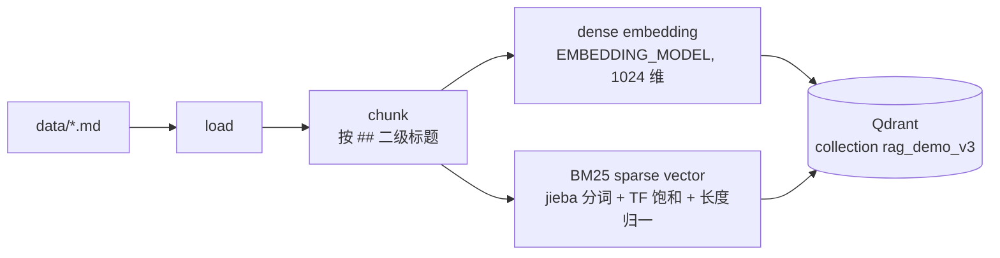
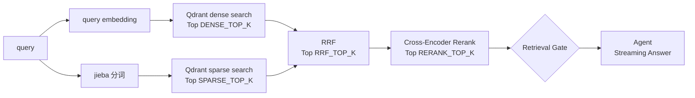
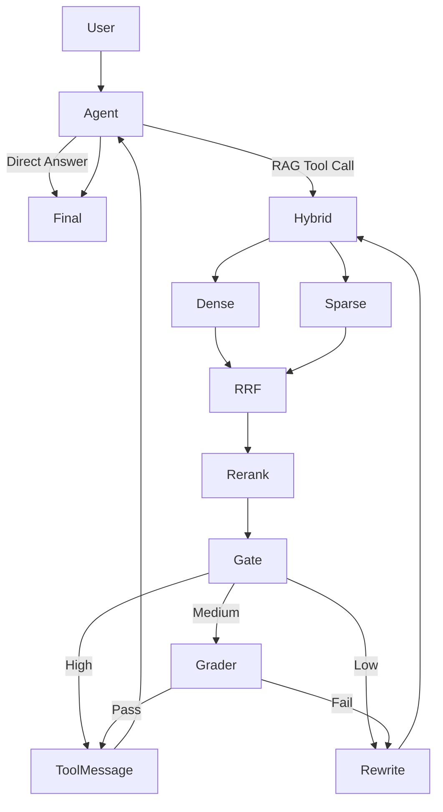

# rag-agent-demo

一个用于**学习 LangChain + LangGraph Agent 编排与 RAG 工程**的 Python Demo，按版本逐步演进：

| 版本 | 核心链路 | 学习重点 |
|---|---|---|
| Version 1 | `Agent ↔ Tool` | Tool Calling、Agent Loop |
| Version 2 | `Retrieve → Grade → Rewrite → Retry` | State、Node、Conditional Edge、Loop、Stop Condition |
| Version 3 | `Hybrid Retrieval → RRF → Rerank → Confidence Gate → Streaming → Observability → Evaluation` | RAG Engineering、Retrieval Quality、Latency Analysis、Evaluation |
| **Version 4（当前）** | `Incremental Indexing & Reliability` | Timeout 定位 / Retry / Deadline、Chunk Quality、增量索引、Query Understanding、Multi-Tool、Structured Contract、No-Answer、Source Tracking、Regression |

> V4 的说明见下方「Version 4」一节；其后的第 1~10 节是 V3 文档（仍然有效的部分未改动，Collection 名、Eval 入口等已被 V4 取代处以 V4 一节为准）。

核心原则：**LangGraph 负责业务流程编排；RAG 模块内部负责检索 pipeline。**

---

## Version 4：Incremental Indexing & Reliability

### 运行

```bash
docker compose up -d
python scripts/build_index.py                # 增量；fingerprint 变化时自动 Blue-Green（新 collection → eval gate → alias 原子切换）
python main.py                               # 内置 Case（含多轮 / 5 个 Tool / No-Answer / Multi-Tool）
python main.py --chat                        # 交互式多轮
python main.py --mode v3_agent "Redis 怎么扩容？"   # V3 Routing 仍可用
python eval/run_regression.py [--ab]         # 统一 Regression
python scripts/reproduce_timeout.py          # 复现 V3 的 60s timeout + V4 定位
python scripts/verify_incremental.py         # 增量索引正确性验证（独立测试 collection）
```

### 新增 / 修改的模块（只做了最小必要的目录调整）

```text
llm/client.py              统一 LLM / Embedding 调用：分阶段 timeout、Retry Policy、Deadline、逐 attempt Trace、
                           Structured Output 单次调用 + 同一 raw response 容错解析、httpx 层故障注入
observability/tracing.py   AttemptRecord（request_id / call_id / phase / attempt / first_token / status / retry…）→ logs/trace.jsonl
observability/versions.py  运行版本（chat / embedding / reranker / BM25 / chunk / prompt version）写进 Eval Report
query/understanding.py     Query Understanding（Contextual Rewrite + Intent + Entity + Candidate Tools，一次 LLM 调用）
query/rewrite.py           Retrieval Rewrite（只在检索失败后使用）
query/schema.py            QueryUnderstandingResult / RetrievalRewriteResult / GradeResult
tools/registry.py          5 个 Tool 的边界说明、Args Schema、动态 Binding、Validation、安全执行
tools/schemas.py           ToolResult Contract + 错误码
tools/document.py          get_document / get_chunk / list_documents（Qdrant 精确查询）
tools/index_status.py      get_index_status
rag/chunking.py            按标题层级切分、section_path、raw_text / retrieval_text、A/B/C、Chunk Analysis
rag/manifest.py            SQLite Index Manifest
rag/indexing.py            增量 Indexing、Pipeline Fingerprint、冻结 avgdl、Blue-Green + Eval Gate
agent/nodes.py / graph.py  query_understanding / agent / tool_dispatch + V3 的 retrieve / grade / rewrite / build_tool_message
eval/*                     retrieval / chunk / query / tool / regression
```

### Graph

```text
START ─(query_understanding)→ query_understanding ─(单 Tool 且参数确定)→ tool_dispatch
  │                                    └────────(MULTI_TOOL / 低置信度)──→ agent
  └──(v3_agent)──────────────────────────────────────────────────────→ agent
agent ─(无 tool_call)→ END
  └─(1..N 个 tool_call)→ tool_dispatch ─(search_knowledge_base)→ retrieve → Gate → [grade] → [rewrite] → build_tool_message ─┐
                             ↑  └─(其余 Tool 在 dispatch 内顺序执行；全部 tool_call 都有 ToolMessage 后)→ agent         │
                             └────────────────────────────────────────────────────────────────────────────────────────┘
```

7 个 Node，按职责划分：Hybrid / RRF / Rerank / Gate 仍在 `retrieve` 一个 Node 内；4 个确定性 Tool 都在 `tool_dispatch` 内执行。

### 1. Timeout 定位（`scripts/reproduce_timeout.py`，日志 `eval/reports/timeout_reproduction.log`）

V3 的 60.47s 发生在 **final_answer 的首 token 等待**（README V3 记录：`model_ttft` max = 60472.7 ms）。V3 当时 `timeout=60, max_retries=2`，openai SDK 在内部静默重试，日志里只有一次 60s 的调用。

在 httpx transport 层注入"请求挂起直到 read timeout"重放 V3 配置（真实走 `httpx.ReadTimeout → openai.APITimeoutError` 路径）：

```text
[V3 view]   final_llm：model_ttft=60971 ms  total=61462 ms   ← 调用方只能看到这两个数
[V3 hidden] SDK 实际发出 HTTP 请求 2 次：第 1 次 60s read timeout → APITimeoutError → 静默重试；第 2 次 ≈971 ms 首 token
```

结论：**phase = final_answer，attempt 1，error_type = APITimeoutError（底层 httpx.ReadTimeout，等首 token 的读超时），latency ≈ 60s，随后 attempt 2 成功**——与 V3 实测的 "60.47s 后正常输出" 吻合。V3 当时没有逐 attempt 记录，所以"服务端为什么没响应"本身无法从历史日志确认，只能确认它是 read timeout + SDK 重试。

V4 同样的故障，trace 直接定位：

```text
[LLM] req=3cbc6261 call=3cbc6261-03 phase=final_answer attempt=1 status=timeout latency=10007ms timeout=10.0s error=APITimeoutError → retry (reason=timeout)
（attempt 2 成功：model_ttft 10898 ms − attempt 1 的 10007 ms ≈ 891 ms 首 token；请求 total 15337 ms）
```

其他已验证场景：`query_understanding` 429 → `rate_limit` → retry 成功；`agent_decision` 500 → `server_error` → retry 成功；`query_rewrite` 连接失败 → `connection_error` → retry 成功；`REQUEST_DEADLINE=12` 且 final_answer 连续挂起 → attempt 1 的 timeout 被自动压缩到 9.59s、不再发起 attempt 2，**请求在 12009 ms 结束**并返回明确的错误提示。

| | 修改前（V3 配置 + 首 token 挂起） | 修改后（V4 默认） |
|---|---|---|
| 单次故障的 max latency | 61.5 s（实测重放）；V3 eval 历史 max 62.5 s | 15.3 s（10s timeout + retry） |
| 最坏情况 | 60s × 3 次 attempt ≈ 180 s | 被 `REQUEST_DEADLINE=30s` 截断（实测 12s deadline 时 12.0 s） |
| 正常情况 p95（V3 Eval 24 条 / 同模型） | total p95 3747.9 ms，max 6803.9 ms（`eval/reports/v3_baseline_eval.log`） | 见下方 Regression |

**分阶段 Timeout（`config.py`）**：QU 12s / Agent Decision 12s / Grader 5s / Rewrite 5s / Final Answer 10s / Embedding 5s / Tool 5s / Request Deadline 30s。初始值 ≈ 当前 Provider 实测 p95 的数倍；**中途切换到 qwen3.8-flash 后 QU 单次实测 2.0~7.9s，因此 QU / Agent Decision 从 8s 调到 12s**。这些值没有普适性。

**Retry Policy**：只重试 `timeout / connection_error / 429（非 insufficient_quota）/ 500·502·503·504`，`LLM_MAX_ATTEMPTS=2`；`parse_error / validation_error / Grader=false / 检索为空` 不触发新请求；流式输出已产出 token 后中断记为 `stream_interrupted`，不重试。SDK `max_retries=0`。

**Deadline**：每次 attempt 的 timeout = `min(phase_timeout, remaining - reserve)`，不足 1s 不发请求（`deadline_exceeded`）。预算不足时：Grader 跳过（fallback：rerank_score ≥ 0.5 放行）、Retrieval Rewrite 跳过、Agent 不再绑定 Tool。

### 2. Structured Output 双调用

V3：`with_structured_output(method="function_calling")` 在当前模型上经常**不调用 function、直接输出纯文本**（本次实测 Rewrite 3/3 次 `parsed=None`，见探针），然后 V3 再 `llm.invoke()` 一次 → 双调用。

V4：`structured_call()` 改用 `response_format=json_schema`（实测 3/3 直接合法 JSON），一次请求 → 严格解析 → 失败则对**同一个 raw response** 依次尝试 tool_call args / 去 code fence / 截取 `{…}` / 单字段纯文本；仍失败且有预算才允许 re-ask（`STRUCTURED_MAX_REASK=1`）。每次 structured 调用记录 `llm_requests`。Regression 中 `structured_reask_count = 0`，**每次 Rewrite 都是 llm_requests=1，双调用已消除**。

### 3. Chunk Strategy（`eval/run_chunk_eval.py`，`eval/reports/chunk_strategy.log`）

切分改为按 `##` / `###` 标题层级（chunk 边界在 A/B/C 三种策略下完全相同，只有 `retrieval_text` 不同）；Payload 增加 `raw_text / retrieval_text / document_title / section_path / content_hash`。`retrieval_text` 用于 Dense / BM25 / Reranker，**交给 LLM 的 Context 只用 `raw_text`**。新增 `redis_ops.md`、`mysql_ops.md`（多级标题，同主题不同答案）。

Chunk Analysis（31 chunks，jieba token）：avg 53.8 / p50 52 / p95 96.5 / min 16 / max 123；too_short(<32) = **16.1%**（`mysql_ops_002/004/005/006`、`redis_ops_003`，都是一两句话的 `###` 小节）；too_long(>400) = 0。**按 `###` 切分的运维文档确实偏碎**，C 策略把标题路径拼进 retrieval_text 后 too_short 降到 9.7%。

Retrieval Eval（60 条有标注 + 5 条无答案；同一数据集、三个独立 collection）：

| stage | metric | A raw | B title+section | C title+path |
|---|---|---|---|---|
| dense | R@1 / R@3 / R@5 / MRR | 0.844 / 0.925 / 0.950 / 0.935 | 0.886 / 0.964 / 0.983 / 0.969 | 0.886 / 0.975 / 0.983 / 0.969 |
| sparse | R@1 / R@3 / R@5 / MRR | 0.764 / 0.894 / 0.917 / 0.868 | 0.842 / 0.928 / 0.928 / 0.917 | 0.847 / 0.933 / 0.933 / 0.925 |
| hybrid_rrf | R@1 / R@3 / R@5 / MRR | 0.819 / 0.931 / 0.972 / 0.922 | 0.869 / 0.956 / 0.978 / 0.954 | 0.869 / 0.956 / 0.983 / 0.954 |
| hybrid_rerank | R@1 / R@3 / R@5 / MRR | 0.797 / 0.933 / 0.969 / 0.903 | 0.864 / 0.956 / 0.961 / 0.939 | **0.869 / 0.961 / 0.978 / 0.953** |

按类别（hybrid_rerank MRR）：`same_topic` A 0.840 → B/C 1.000；`ambiguous` A 0.750 / B 0.778 / C 1.000；`v3_basic` 三者都是 0.979（V3 数据集确实太容易，拉不开差距）。

**选择 C**：事先固定的规则是 `max(hybrid_rerank MRR, R@1, hybrid_rrf MRR)`，C 在 hybrid_rerank 的 4 个指标上都最高。差异主要来自 `redis_ops` / `mysql_ops` 里"扩容 > 扩容触发条件"这类同名小节——没有上级标题时 A 无法区分 Redis 和 MySQL。`exact_id` 类（query 里写 `redis_003`）三种策略都很差，这正是需要 `get_chunk` 精确查找、而不是靠向量检索的原因。

### 4. Incremental Indexing（`scripts/verify_incremental.py`，19/19 checks passed）

| 场景 | 实测 |
|---|---|
| 第一次 | 9 文档 → 31 chunk，31 embedded（9 次 Embedding 请求） |
| 第二次无修改 | **0 chunking / 0 embedding / 0 Embedding 请求 / 0 写入**，9 个文件 `unchanged → skipped`，3.3 ms |
| 修改 `redis_ops.md`（改 1 句 + 新增 1 小节） | 只处理该文件：**7 个 chunk 重新 chunk，2 个 embedding，5 个按 content_hash 复用旧向量（逐位相同）**，其他 8 个文件 skip |
| 删除 `api.md` | Qdrant 中 api 的 2 个 point → 0，manifest 同步删除 |
| 新增 `faq.md` | 1 chunk → 1 embedding → upsert → manifest |
| fingerprint 变化、file_hash 不变 | 9/9 文件重新处理（不 skip）；目标 collection 名随 fingerprint 变化 → `build()` 走 Blue-Green |

Manifest（SQLite，`index_state/manifest.db`）：`documents(collection, document_id, source_path, file_hash, pipeline_fingerprint, chunk_ids, token_count, indexed_at)` + `collections(strategy, pipeline_fingerprint, fingerprint_detail, bm25_avgdl, status, revision, eval_summary…)`。

**Pipeline Fingerprint** = sha256 of：`embedding_model, embedding_dimension, chunk_strategy_version, chunk_enrichment_mode, splitter_config{split_level, max_chars, overlap_chars}, retrieval_text_version, bm25{version, k1, b, tokenizer(jieba 版本 + lcut_for_search + lower), stopwords_md5, token_id=md5-32bit}, sparse_representation`。

### 5. Sparse Incremental Correctness

| 组成 | 全局依赖？ | 问题 |
|---|---|---|
| jieba / 停用词 / token_id | 否 | 变化时进 fingerprint |
| TF 饱和（k1） | 否 | — |
| 长度归一化 | **avgdl** | V3 每次全量重算 avgdl；若增量时只给新文档用新 avgdl，新旧 value 不一致 |
| IDF（Qdrant `modifier=IDF`） | **N、df** | 查询时实时计算，但**实测删除的 point 在 segment vacuum 前仍计入 IDF**；默认 `vacuum_min_vector_number=1000`，小 collection 永远不清理 |

选择方案 A（保留自研 BM25，明确重建条件）：
1. **avgdl 在 collection 创建时冻结**写入 manifest，所有增量写入沿用（FastEmbed 标准 Bm25 的 `avg_len` 也是固定参数）。每次构建报告 `actual avgdl` 与 drift，超过 20% 提示 `--rebuild`（Blue-Green 全量重建）。
2. collection 创建时设 `deleted_threshold=0.0001, vacuum_min_vector_number=1`，Indexing 结束等 collection 回到 green。
3. 验证：增量 collection vs "同一冻结 avgdl 的全量重建"——payload、sparse vector **逐 point 一致**；**65/65 个 query 的 Qdrant BM25 分数完全一致**。对照组（默认 optimizer，写入并删除一批临时 point）：**63/65 个 query 分数不同**。dense 向量 min cos=0.9975：不是增量的问题，而是 Embedding Provider 本身不确定（同一 batch 重复请求 cos≈0.998）。

没有迁移到 FastEmbed Bm25，因此不需要迁移回归；切到 C 策略后 Retrieval Eval 见上表。

### 6. Blue-Green

在线只访问 alias `rag_demo`；物理 collection = `rag_demo_v4_<strategy>_<fingerprint前8位>`。fingerprint 变化 → 新建 collection 全量构建（旧的继续服务）→ Retrieval Eval Gate（hybrid_rerank R@5 ≥ 0.85 且 MRR 不低于当前 0.05 以上）→ 一次 `update_collection_aliases`（delete + create 同一请求，Qdrant 原子执行）→ 旧 collection 标记 `retired` 保留可回滚。实测：`(none) → rag_demo_v4_c_0073c1ee`，gate `R@5=0.9778, MRR=0.9533`。V3 的 `rag_demo_v3` 原样保留未删除。

### 7. Query Understanding（`query/understanding.py`）与两类 Rewrite

```python
class QueryUnderstandingResult(BaseModel):
    standalone_query: str
    intent: Literal["DIRECT", "KNOWLEDGE_SEARCH", "DOCUMENT_LOOKUP", "CHUNK_LOOKUP",
                    "DOCUMENT_LIST", "INDEX_STATUS", "MULTI_TOOL"]
    entities: list[str]
    constraints: list[str]          # 数字 / 时间 / 版本 / 否定条件
    document_id: str | None
    chunk_id: str | None
    topic: str | None
    candidate_tools: list[str]
    confidence: float               # [0, 1]
```

- **Contextual Rewrite**：`query/understanding.py` 的 `PROMPT` + `understand()`，在 `query_understanding_node` 中执行，输入 raw query + 最近 3 轮对话。LLM 输出后再由 `enforce_contract()` 做确定性检查：raw 中的 chunk_id / document_id 必须保留（丢失则补回）、数字 / 否定词丢失则记 violation（单轮时退回 raw）、candidate_tools 只保留已注册 Tool 并与 Intent 默认候选取并集。
- **Retrieval Rewrite**：`query/rewrite.py` 的 `retrieval_rewrite()`，在 `rewrite_query_node` 中执行；只在 Gate=LOW 或 MEDIUM+Grader 0 相关时触发，输入 standalone_query + 当前检索 Query + 证据摘要 + retry_count，不做 Intent。
- 第一次检索使用 `standalone_query`（tool_log 中 `query_source=standalone_query`）。
- 多轮验证：`Redis 怎么部署？` → `那它扩容呢？` → standalone_query = **`Redis 怎么扩容？`** → redis_ops_004 / redis_ops_003。
- 单 Tool 且参数确定时，QU 直接生成 tool_call（跳过一次 Agent Decision）；MULTI_TOOL / 低置信度交给 Tool Agent。

### 8. Multi-Tool

| Tool | Use when | Do NOT use when |
|---|---|---|
| `search_knowledge_base(query)` | 团队系统 / 规范 / 流程 / 运维的模糊知识问题（含知识库可能没有的组件） | 已给 chunk_id、要整篇文档、问有哪些文档、问索引状态、通用常识 |
| `get_document(document_id, view=full\|outline)` | 明确指定 document_id 或要求整篇 / 全文 / 大纲 | 只是提了 Redis 等主题词的知识问题；引用的是 chunk_id |
| `get_chunk(chunk_id)` | 明确引用 `<doc>_<3 位数字>` | 没给 chunk_id；不得猜测 ID |
| `list_documents(topic?)` | 有哪些文档 / 某主题有哪些文档 | 具体知识；chunk 数 / 索引版本 |
| `get_index_status()` | 索引规模、版本、embedding 模型、chunk 策略、更新时间（不返回任何密钥 / URL） | 具体知识、文档列表 |

- Args 全部是 Pydantic（`extra=forbid`、正则、长度、enum）；执行前 `validate()`，失败返回 `INVALID_ARGUMENT` 的 ToolMessage，不崩溃。
- `ToolResult{success, data, error_code, message, source_ids, chunk_ids, document_ids, retrieval_status}`；错误码 `INVALID_ARGUMENT / NOT_FOUND / TIMEOUT / DEPENDENCY_ERROR / INTERNAL_ERROR`（+ Loop Safety 的 `DUPLICATE_TOOL_CALL / TOOL_BUDGET_EXCEEDED`）；ToolMessage 只含结构化 JSON，不含 traceback。
- **Candidate Tool Gating**：Intent → 默认候选（如 INDEX_STATUS → `[get_index_status]`，DIRECT → 不绑定 Tool），每轮 `bind_tools` 只绑定候选。
- **多个 tool_call**：`tool_dispatch` 维护 `tool_queue` 顺序执行，`search_knowledge_base` 跳入 RAG 子流程后回到 dispatch 继续；`invalid_tool_calls`、被拦截的调用也都有 ToolMessage——不依赖 Prompt 保证协议。实测 `分别看一下 redis_003 和 mysql_002` 一条 AIMessage 中 2 个 get_chunk。
- **Loop Safety**：`MAX_TOOL_CALLS_PER_REQUEST=4`；同一 Tool + 相同参数第 2 次 → `DUPLICATE_TOOL_CALL` 并停用 Tool；`recursion_limit=60`。
- Multi-Tool 实测：`Redis 脑裂处理出自哪篇文档？把那篇完整内容给我` → `search_knowledge_base → ToolMessage → Agent → get_document(redis_ops) → ToolMessage → Agent → Final Answer`。

### 9. Context Dedup / No-Answer / Sources

- **Dedup**：`rag/pipeline.dedup_documents()`：chunk_id 去重 + 规范化正文 md5 去重，并跳过本请求中已交给 LLM 的 `used_chunk_ids`。
- **No-Answer**：`retrieval_status ∈ FOUND / NOT_FOUND / FAILED`。本轮所有 Tool 都是 search 且都是 NOT_FOUND → **不调用 LLM**，固定返回「知识库中没有足够信息支持回答。」（`Kafka ISR 是怎么实现的？`：LOW → Rewrite → LOW → max retry → 固定文案）。检索依赖失败 → 固定的"检索暂时不可用"。
- **Sources**：最终回答后由代码根据 State 中的 `sources`（只来自真实 ToolResult 的 source_ids）追加 `Sources:`；Prompt 禁止 LLM 写来源。Eval 检查 Sources ⊆ Tool source_ids、正文中的 chunk_id 都出现在 Tool 输出里。

### 10. Routing A/B（v3_agent vs query_understanding）

数据：`eval/tool_dataset.json`（42 条，含 DIRECT / KNOWLEDGE_SEARCH / DOCUMENT_LOOKUP / CHUNK_LOOKUP / DOCUMENT_LIST / INDEX_STATUS / MULTI_TOOL / 错误 document_id / 错误 chunk_id / 易混淆）+ `eval/query_dataset.json`（17 条多轮）。**A/B 在 qwen3.7-flash-2026-07-15 上完成**（`eval/reports/tool_eval_ab_qwen3.7.*`、`query_eval_ab_qwen3.7.*`）；之后 chat 模型被切换为 qwen3.8-flash，Regression 只在新模型上跑默认模式。

| 指标 | v3_agent | query_understanding |
|---|---|---|
| Intent Accuracy（tool / query 集） | 0.952 / 0.941 | **1.000 / 1.000** |
| Candidate Tool Recall | 1.0（绑定全部） | 1.000 |
| Tool Selection Accuracy | 0.929 | **1.000** |
| First Tool Accuracy | 0.952 | 1.000 |
| Tool Argument Valid Rate | 1.000 | 1.000 |
| Tool Execution Success Rate | 1.000 | 1.000 |
| Unnecessary / Wrong Tool Rate | 0.024 / 0.048 | 0 / 0 |
| Multi-Tool Task Success | 0.75 | **1.00** |
| Expected Args Accuracy | 0.778 | 1.000 |
| 多轮 Query 正确率（must_contain） | 0.875 | **1.000** |
| 第一次检索 Recall@5（多轮集） | 0.917 | **1.000** |
| Direct Query E2E TTFT p50 / p95 | **926 / 1154 ms** | 1681 / 1692 ms |
| RAG Query E2E TTFT p50 / p95 | **2693** / 4004 ms | 2834 / **3583** ms |
| Agent Decision（首次）p50 | 956 ms | 735 ms（只在 4 条 MULTI_TOOL 中触发） |
| Query Understanding p50 / p95 | — | 1618 / 2032 ms |

v3_agent 的典型错误：`那它扩容呢？` 直接回答（没有调用 Tool），`给我 kafka 文档的完整内容` 走了 list_documents + search。

**默认 `ROUTING_MODE=query_understanding`**：准确率全面更高；代价是 DIRECT 问题多一次 LLM 调用（TTFT +~750 ms），RAG 问题 p50 持平（QU 替代了 Agent Decision）、p95 更低。若业务以闲聊为主应重新权衡。

### 11. Regression（`python eval/run_regression.py`）

见 `eval/reports/regression_summary.json` / `regression.log`（结果在下方「Regression 实测」）。

### 12. 剩余问题

1. **QU 本身成为了 TTFT 的固定成本**：每个请求都多一次结构化 LLM 调用（新模型实测 2~8s 波动），DIRECT 问题首字变慢；需要规则 / 小模型预分类或与回答合并的方案。
2. **Gate 阈值与 avgdl 仍是手工基线**：无答案 query 的 rerank top1 最高到 0.79（C 策略），进入 MEDIUM 后依赖 LLM Grader 兜底；语料增长后冻结 avgdl 会漂移，只能靠 drift 报警 + Blue-Green 重建。
3. **Eval 规模和确定性不足**：60 条检索样本、42 条 Tool 样本，LLM 输出有随机性，单次运行的差异（如 0.95 vs 1.0）不具统计显著性；Embedding Provider 本身也非确定性（cos≈0.998）。

### Regression 实测

见 `V4_STATUS.md`「Regression 实测」（qwen3.8-flash 上 12/12 PASS）。

```text
rag-agent-demo/
├── data/                   # 知识库：7 篇 Markdown（redis / rag / agent / deploy / oncall / mysql / api）
├── config.py               # 集中配置：模型、Qdrant、Top-K、RRF、Gate 阈值、MAX_RETRY（均可被 .env 覆盖）
├── rag/                    # 检索层（不依赖 agent）
│   ├── store.py            #   Qdrant 连接、Point 数据模型
│   ├── indexing.py         #   Offline：load → chunk → dense embedding → BM25 sparse → Qdrant
│   ├── dense_retriever.py  #   query embedding + Qdrant dense search
│   ├── sparse_retriever.py #   jieba 分词 + BM25 sparse vector + Qdrant sparse search
│   ├── fusion.py           #   Reciprocal Rank Fusion
│   ├── reranker.py         #   Cross-Encoder Reranker（bge-reranker-base，本地 ONNX）
│   ├── gate.py             #   Retrieval Gate：HIGH / MEDIUM / LOW
│   └── pipeline.py         #   Online：retrieve(query) = Dense + Sparse → RRF → Rerank
├── agent/                  # 编排层
│   ├── state.py            #   AgentState（V2 字段 + gate_level / top_rerank_score）
│   ├── tools.py            #   search_knowledge_base：交给 LLM 的"工具说明书"
│   ├── nodes.py            #   Node / 路由 / LLM / Prompt；Agent 流式输出与 TTFT 打点
│   └── graph.py            #   只做编排：加节点、加边、compile
├── observability/
│   └── metrics.py          # perf_counter 阶段计时、TTFT、Performance Report
├── scripts/
│   └── build_index.py      # Offline Indexing 入口
├── eval/
│   ├── dataset.json        # 24 条 query → relevant_chunk_ids
│   └── run_eval.py         # Recall@K / MRR / latency avg-p50-p95
├── main.py                 # Online Query 入口：流式回答 + Performance Report
├── docker-compose.yml      # 单节点 Qdrant，数据挂载到 ./qdrant_storage
├── requirements.txt
└── .env.example
```

模块依赖方向（单向，无循环 import）：

```text
main.py ──→ agent/graph.py ──→ agent/nodes.py ──→ rag/pipeline.py ──→ dense / sparse / fusion / reranker ──→ rag/store.py ──→ Qdrant
                                    │                rag/gate.py
                                    └──→ agent/state.py, agent/tools.py
observability/metrics.py ← 被 rag、agent、main 调用（它自己不 import 任何业务模块）
config.py                ← 被所有模块读取
```

`rag/` 中没有任何 `import agent`。rag 层通过 `ContextVar` 拿到当前请求的 metrics 对象，不需要 agent 把 metrics 作为参数传进来。

---

## 1. 运行方式

```bash
cd rag-agent-demo
python3 -m venv .venv && source .venv/bin/activate
pip install -r requirements.txt
cp .env.example .env                 # 填入 API Key / Base URL / 模型名

# 1) 启动 Qdrant（REST 6333 / gRPC 6334，数据持久化在 ./qdrant_storage）
docker compose up -d

# 2) Offline Indexing：构建完成后退出；文档变更后重新运行
python scripts/build_index.py

# 3) Online Query：只读已有索引，不会重新做文档 Embedding
python main.py                       # 依次运行内置的 5 个 Case
python main.py "灰度发布分几个阶段？"   # 自定义问题

# 4) Offline Evaluation
python eval/run_eval.py              # 检索评测 + 端到端评测（会调用 Chat 模型）
python eval/run_eval.py --no-e2e     # 只跑检索评测
```

- 首次运行会从 HuggingFace 下载 Reranker 模型 `BAAI/bge-reranker-base`（约 1 GB），之后从 `~/.cache/fastembed` 加载。
- Qdrant Dashboard：<http://localhost:6333/dashboard>。`docker compose down && docker compose up -d` 后，索引仍然存在。
- 在线进程启动时会先 `warmup()`：检查 collection 是否存在，加载 Reranker 和 jieba 词典。这些时间不计入任何一次请求的 latency。

---

## 2. Indexing Pipeline 与 Query Pipeline

V2 在 `import rag.retriever` 时就会把全部文档重新 Embedding 一遍，写进 `InMemoryVectorStore`，进程退出后索引就丢了。V3 把这条链路拆成两条独立的 Pipeline：

### Offline Indexing Pipeline（`python scripts/build_index.py`）



实测：7 篇文档 → 19 个 chunk，总耗时约 1.6 s，其中 dense embedding 约 1.0 s。

### Online Query Pipeline（`python main.py "问题"`）



在线进程只对 **query 本身**做一次 Embedding，不会读取 `data/`，也不会 import `rag/indexing.py`。

### Qdrant Point 结构

一个 chunk 对应一个 Point：

```json
{
  "id": "uuid5(chunk_id)",
  "vector": {
    "dense": [0.0123, -0.0456, "... 共 1024 维"],
    "bm25":  {"indices": [190934187, 2836301834, "..."], "values": [1.58, 1.21, "..."]}
  },
  "payload": {
    "document_id": "redis",
    "chunk_id": "redis_001",
    "source": "data/redis.md",
    "title": "Redis 使用手册",
    "topic": "Redis 的用途",
    "text": "## Redis 的用途\n\nRedis 是一个基于内存的 Key-Value 数据库……"
  }
}
```

- `dense`：Named dense vector，Cosine 距离。
- `bm25`：Named sparse vector，collection 配置为 `modifier=IDF`，IDF 由 Qdrant 根据当前 collection 统计；文档侧的 value 只存 BM25 的 TF 部分。
- `id`：用 `chunk_id` 计算 uuid5，同一个 chunk 每次重建索引得到的 id 都相同。

---

## 3. Version 3 完整 Graph



上图省略了 Stop Condition：`retry_count` 达到 `MAX_RETRY` 后，Low 和 Grader Fail 都会直接进入 ToolMessage（内容为"没找到"），不再 Rewrite。

LangGraph 中实际的节点（`agent/graph.py`）比上图少。Hybrid、Dense、Sparse、RRF、Rerank、Gate 都在 `retrieve` 这一个 Node 里，由 `rag.pipeline.retrieve()` 和 `rag.gate.retrieval_gate()` 完成：

```python
builder.add_edge(START, "agent")
builder.add_conditional_edges("agent", route_after_agent, ["retrieve", END])

builder.add_conditional_edges("retrieve", route_after_gate, ["build_tool_message", "grade_documents", "rewrite_query"])
builder.add_conditional_edges("grade_documents", route_after_grading, ["build_tool_message", "rewrite_query"])
builder.add_edge("rewrite_query", "retrieve")

builder.add_edge("build_tool_message", "agent")
```

和 V2 相比，编排只改了一处：`retrieve` 之后不再固定进入 `grade_documents`，而是由 `route_after_gate` 分成三路。

---

## 4. Hybrid Retrieval

| | Dense | Sparse / BM25 |
|---|---|---|
| 擅长 | **语义召回**：同义改写、换种说法（"撤回版本" ≈ "回滚"） | **关键词召回**：专有名词、代号、错误码（`AUTH-4031`、`Egret`、`KEYS`） |
| 实现 | `embed_query()` → Qdrant `query_points(using="dense")` | `jieba.lcut_for_search` → `{token_id: 1.0}` → Qdrant `query_points(using="bm25")` |
| 分数 | Cosine，0~1 | BM25，0~十几，无上界 |

BM25 公式拆成两部分，分别在两个时机计算：

```text
BM25(q, d) = Σ_{t∈q}  IDF(t)  ·  tf·(k1+1) / (tf + k1·(1 − b + b·|d|/avgdl))
                      └Qdrant┘   └─────────── 离线算好，作为文档 sparse vector 的 value ───────────┘
```

- 文档侧（离线）：分词后统计 tf，用 `avgdl` 计算 TF 饱和和长度归一化。
- 查询侧（在线）：每个 query 词的权重是 1.0，Qdrant 做点积时再乘以它维护的 IDF。在线查询不需要扫描文档，也不需要 `avgdl`。
- `token_id`：取词的 md5 前 32 位，不需要维护词表文件。

## 5. RRF Fusion（`rag/fusion.py`）

```python
for source, documents in ranked_lists.items():          # dense / sparse
    for rank, doc in enumerate(documents, start=1):
        scores[chunk_id] += 1.0 / (k + rank)             # k = RRF_K = 60
```

Cosine 的取值是 0~1，BM25 是 0~十几且没有上界。如果用 `0.7 * dense + 0.3 * bm25` 直接加权，结果主要由 BM25 的量纲决定。RRF 只看名次：两路都排在前面的文档得分最高，只出现在一路里的文档也能拿到 `1/(k+rank)`。

## 6. Reranker（`rag/reranker.py`）

```python
rerank(query, documents, top_k=5) -> list[RerankResult(document, rerank_score)]
```

- 模型：`BAAI/bge-reranker-base`，中英双语 Cross-Encoder，通过 `fastembed` 以 ONNX Runtime 在本地 CPU 上运行，不需要 GPU，也不需要 PyTorch。
- Embedding 是 Bi-Encoder：query 和文档分别编码，再计算相似度。Cross-Encoder 把 `(query, document)` 拼成一个输入，能看到两者逐词的交互，所以排序更准；代价是每个候选都要跑一次模型，只适合对 RRF Top N 做精排。
- 模型输出的是 logit，经过 sigmoid 映射到 `[0, 1]`，作为 `rerank_score` 交给 Gate 使用。
- 要换模型，实现同样签名的 `rerank()` 并在 `get_reranker()` 里返回即可（见 `Reranker` Protocol）。

## 7. Retrieval Gate（`rag/gate.py`）与 LLM Grader 职责变化

```text
top1 = 最高 rerank_score

top1 ≥ HIGH_CONFIDENCE_THRESHOLD (0.9)        → HIGH   ：score ≥ HIGH 的文档直接进入 ToolMessage，不调用 LLM
LOW ≤ top1 < HIGH                              → MEDIUM ：score ∈ [LOW, HIGH) 的文档交给 LLM Grader 逐个判断
top1 < LOW_CONFIDENCE_THRESHOLD (0.15) 或为空   → LOW    ：直接 Query Rewrite；重试次数用完则返回"没找到"
```

> **当前阈值仅为 Demo 初始值**，来自本仓库这个小知识库在 bge-reranker-base 上观察到的分数分布：明确问题 top1 ≥ 0.98，模糊问题在 0.17~0.86，跑偏或知识库里没有的问题 ≤ 0.12。它们没有普适性，换语料、换模型都要重新调。**正式系统应根据 Eval Dataset 的分数分布调参。**

| | Version 2 | Version 3 |
|---|---|---|
| 谁来判断相关性 | **每一次检索的每一个文档**都调用 LLM Grader | Reranker 分数先过 Gate；**只有 MEDIUM** 的文档才调用 LLM Grader |
| LLM Grader 调用量 | Top-K 个 / 每次检索 | 实测 24 条评测 query 中只有 3 条请求触发了 Grader |
| Query Rewrite 触发 | Grader 判定 0 个相关 | Gate 判为 LOW，或者 MEDIUM 时 Grader 判定 0 个相关 |

这体现的是一种分工：**确定性的专用模型（Cross-Encoder）负责主路径，LLM 只处理边界上的语义判断。** 高分直接放行、低分直接重写，两头都省掉了 LLM 调用的延迟和成本。中间那一段是 Reranker 自己也拿不准的区间，才交给 LLM 判断。

`MAX_RETRY = 1` 继续作为 Stop Condition。`retry_count` 只在 Agent 发起新的 tool_call 时重置，Rewrite Loop 不会无限循环。

---

## 8. Observability（`observability/metrics.py`）

只用 `time.perf_counter()`。每个请求有一个 `RequestMetrics`，记录两类数据：

- **stages**：阶段耗时，由 `with timer("dense_retrieval"):` 记录。同一阶段可以执行多次（Rewrite 后会再检索一次），报告显示总和和次数，例如 `(x2)`。
- **marks**：时间点。TTFT、total 由两个时间点相减得到，**不是各阶段相加**。

| 指标 | 开始 | 结束 | 代码位置 |
|---|---|---|---|
| `agent_decision` | Agent 发起产出 tool_call 的那次 LLM 请求 | 该请求的流结束 | `agent_node` |
| `hybrid_retrieval` | 进入 `retrieve()` | RRF 完成（包含下面 4 项的墙钟时间） | `rag/pipeline.py` |
| `query_embedding` | 调用 Embedding API | 拿到 query 向量 | `dense_retriever.embed_query` |
| `dense_retrieval` | 向 Qdrant 发起 dense 查询 | 返回结果 | `dense_retriever.dense_search` |
| `sparse_retrieval` | 开始 jieba 分词 | Qdrant sparse 查询返回 | `sparse_retriever.sparse_search` |
| `rrf_fusion` | 开始融合 | 融合排序完成 | `rag/pipeline.py` |
| `rerank` | Cross-Encoder 开始打分 | 排序截断完成 | `rag/reranker.rerank` |
| `retrieval_gate` | 读取 rerank_score | 得到 HIGH / MEDIUM / LOW | `rag/gate.py` |
| `llm_grader` | 第一个 Grader 请求发出 | 最后一个 Grader 请求返回 | `grade_documents_node` |
| `query_rewrite` | Rewrite 请求发出 | 返回新 query | `rewrite_query_node` |
| `build_tool_message` | 开始拼 Context | ToolMessage 构造完成 | `build_tool_message_node` |
| `final_llm` | 最终回答的 LLM 请求发出 | 该请求的最后一个 chunk | `agent_node` |
| `model_ttft` | `final_llm_start` | `final_first_token`：该请求的第一个文本 token | `agent_node` |
| `generation` | `final_first_token` | `final_llm_end` | `agent_node` |
| `e2e_ttft` | `request_start`：`main.ask()` 收到 Query | `first_visible_token`：第一个回答 token **打印到终端之后** | `main.ask` |
| `total` | `request_start` | `request_end`：Graph 流结束 | `main.ask` |

报告里 `skipped` 表示**这个阶段没有执行**；执行了但很快会显示具体数值，例如 `0.012 ms`。两者不会混淆。

`total` 是墙钟时间。现在各阶段是串行的，各项加起来接近 `total`，但两者的定义不同。以后如果 Dense 和 Sparse 并行执行，各项相加会**大于** `total`，所以代码里从不用"阶段相加"来计算 `total`。

### TTFT：Model TTFT 与 E2E TTFT

```text
request_start ──agent_decision(tool_call)──retrieval──rerank──[grader]──[rewrite]──final_llm_start──prefill──first token──decode──end
│                                                                                  │                        │
│                                                                                  └────── model_ttft ──────┤
└────────────────────────────────────────── e2e_ttft ───────────────────────────────────────────────────────┘
```

- **Model TTFT** = `first_final_token_time − final_llm_start_time`：只衡量最终回答那一次 LLM 请求的排队和 prefill 时间。
- **E2E TTFT** = `first_visible_answer_token_time − request_start_time`：用户从提问到看到第一个回答字，中间所有环节都算在内，包括 Agent 路由、检索、Rerank、Grader、Rewrite 和最终 prefill。

**怎样保证 Agent 的 tool_call 不被计入 TTFT：**

1. 一次 LLM 调用要看到输出才知道是 tool_call 还是回答。`agent_node` 对每次调用都先记录 `call_start`，再根据**第一个有意义的 chunk** 分类：带 `tool_call_chunks` 的是内部决策，耗时记为 `agent_decision`，不产生任何标记；带文本 `content` 的才是最终回答，这时才把 `call_start` 记为 `final_llm_start`，并把当前时刻记为 `final_first_token`。
2. 只有被判为回答的文本 chunk，才会通过 LangGraph 的 `get_stream_writer()` 推送到 `stream_mode="custom"`。tool_call chunk、Grader 和 Rewrite 的 structured output 永远不会进入这条流。`main.py` 只消费这条流，看到第一个 token **打印出来之后**才记录 `first_visible_token`。
3. 兜底：如果模型先输出一段文字、再发起 tool_call，`agent_node` 会发出 `retract` 事件，并清除已记录的 TTFT 标记，等真正的最终回答再重新记录。

Case 1（直接回答）中没有单独的 `agent_decision`：决策和回答是同一次 LLM 调用，报告里显示 `n/a`，耗时都在 `final_llm` 里。

---

## 9. 测试 Case（`python main.py`，以下为一次真实运行的输出摘录）

**Case 1：普通问题**：`Agent → Direct Answer`，不进入 RAG

```text
[Agent] LLM called
[Assistant] Python 是一门强调代码可读性和简洁语法的高级通用编程语言……
hybrid_retrieval / rerank / llm_grader ... skipped
final_llm 1196.7 ms | model_ttft 678.5 ms | e2e_ttft 680.0 ms | total 1199.3 ms
```

**Case 2：清晰的知识库问题**：`Hybrid → Rerank → HIGH → ToolMessage`，**不调用 LLM Grader**

```text
[Agent] tool_call: search_knowledge_base args={'query': 'Redis 集群代号和用途'}
[Retrieve] dense  top: redis_001(0.681), redis_003(0.447), rag_003(0.424), ...
[Retrieve] sparse top: redis_001(9.829), rag_003(4.285), redis_003(2.392), ...
[Retrieve] rrf    top: redis_001(0.033), redis_003(0.032), rag_003(0.032), ...
[Rerank]   top: redis_001(1.000), rag_003(0.132), redis_002(0.034), ...
[Gate] HIGH (top rerank_score=1.000, high>=0.9, low<0.15) → pass 1 documents
[Assistant] 根据知识库，我们团队的 Redis 集群代号是「青鸟」（Bluebird）……
agent_decision 920.0 | hybrid_retrieval 356.3 | rerank 313.2 | llm_grader skipped | model_ttft 887.0 | e2e_ttft 2480.8 | total 2821.7 (ms)
```

**Case 3：模糊问题**："我们这边一般怎么上线？" → `MEDIUM → LLM Grader`

```text
[Rerank]   top: deploy_001(0.883), deploy_003(0.169), deploy_002(0.098), ...
[Gate] MEDIUM (top rerank_score=0.883) → 2 documents to LLM Grader
[Grader] deploy_001: relevant / deploy_003: irrelevant
```

**Case 4：检索被带偏**："Agent 应用里用户会话存在哪个组件" → `LOW → Rewrite → Retry → MEDIUM → Grader`

```text
[Rerank]   top: redis_001(0.147), agent_001(0.022), ...
[Gate] LOW (top rerank_score=0.147)
[Rewrite] rewritten query: Agent 应用用户会话数据存储在哪个内部组件
[Retry] 1 / 1
[Rerank]   top: redis_001(0.459), ...
[Gate] MEDIUM → [Grader] redis_001: relevant
hybrid_retrieval (x2) | rerank 832.8 ms (x2) | llm_grader 575.9 | query_rewrite 1399.1 | e2e_ttft 4999.5 | total 5286.7 (ms)
```

**Case 5：知识库中不存在**（Kafka）→ `LOW → Rewrite → MEDIUM → Grader(0) → Max Retry → "没找到"`

**关于随机性**：Agent 写进 tool_call 的 query、Rewrite 生成的 query 和 Grader 的判断都来自 LLM，每次运行可能不同，所以 Case 3、4 不保证每次都走同一条路径。例如另一次运行中，Case 3 的 Agent 把 query 写成了"发布流程 上线 灰度 回滚"，top1 = 0.937，直接走了 HIGH。代码里没有为了让某个 Case 固定通过而写任何业务判断。

---

## 10. Offline Evaluation（`python eval/run_eval.py`）

`eval/dataset.json`：

```json
[{"query": "团队 Redis 集群主要用于什么？", "relevant_chunk_ids": ["redis_001"]}, ...]
```

- `Recall@K = |relevant ∩ TopK| / |relevant|`
- `MRR = mean(1 / 第一个正确结果的排名)`，Top N 中没有命中记为 0

评测会分别计算 dense、sparse、hybrid_rrf、hybrid_rerank 四个阶段的排序，可以直接看出每一步带来了什么。端到端部分会把每条 query 都走一遍完整 Agent Graph，统计 e2e latency、TTFT 和 Gate 分布。

一次实际运行的结果（Embedding / Chat 为公网 API，Reranker 在本机 CPU 上运行）：

```text
stage              Recall@1   Recall@3   Recall@5      MRR
dense                 1.000      1.000      1.000    1.000
sparse                0.917      0.958      0.958    0.938
hybrid_rrf            0.958      0.958      0.958    0.965
hybrid_rerank         0.958      1.000      1.000    0.979

Retrieval Latency (ms)   avg     p50     p95
hybrid_retrieval       155.2   127.7   295.1
rerank                 354.4   398.0   421.7
retrieval_total        509.6   529.2   616.2

End-to-End (ms)          avg     p50     p95      max
total                 5617.8  2869.6  6832.1  62474.3
e2e_ttft              4795.9  2224.4  5691.7  62056.1
model_ttft            3112.7   586.8  1030.8  60472.7
```

怎么读这组数据：

- 语料很小，Dense 已经满分，Hybrid 在这个数据集上**没有提升**，RRF 还被 BM25 的一次排序失误拉低了 Recall@1。这个结果符合预期：Hybrid 的价值在大语料、专有名词多的场景下才明显。数据集越小，越要避免把 Demo 结果外推到生产。
- avg 被一次偶发的 Chat API 卡顿拉高：第 15 条 query 的最终回答等首 token 等了 60.47 s，这就是 `model_ttft` 的 max 值。同一条 query 复测 10 次都在 0.75 s 以内。当时配置是 `timeout=60`，一次卡顿最长可以等满一分钟；现在已改为 `API_TIMEOUT=5, API_MAX_RETRIES=3`（见 `config.py`）。p50 更能代表典型情况，这也是延迟统计要看分位数、不能只看平均值的原因。

> 数据集只有 24 条，语料只有 19 个 chunk，**p95 仅用于 Demo，不具备生产统计意义**。延迟里包含公网调用 Embedding / Chat API 的网络波动。

---

## 小技巧

查看 LangGraph 实际编译出的图（需要 Qdrant 已启动）：

```python
from agent.graph import graph
print(graph.get_graph().draw_mermaid())
```
