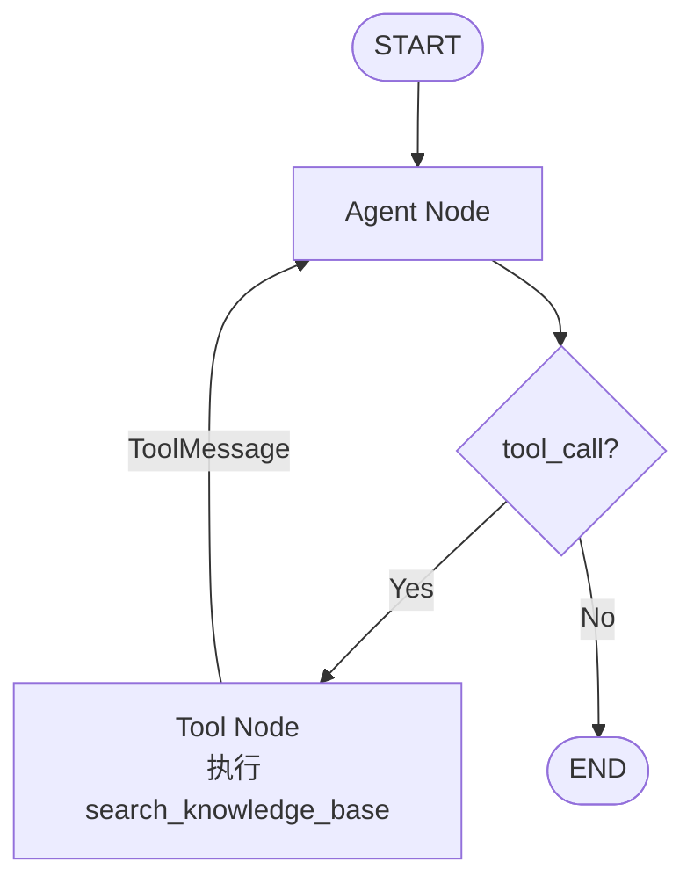
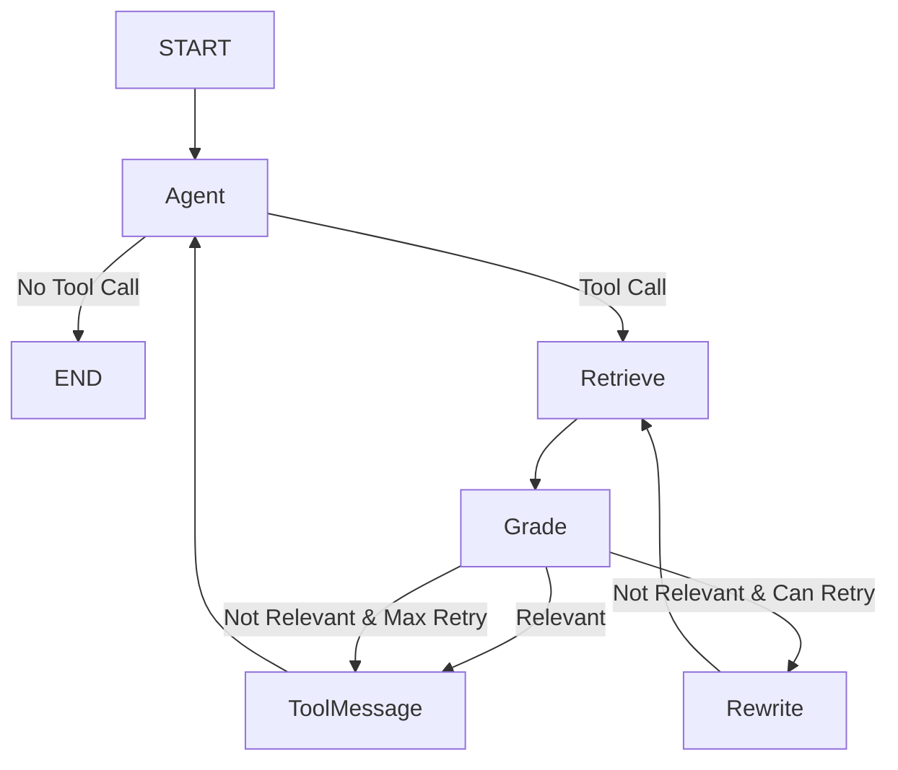
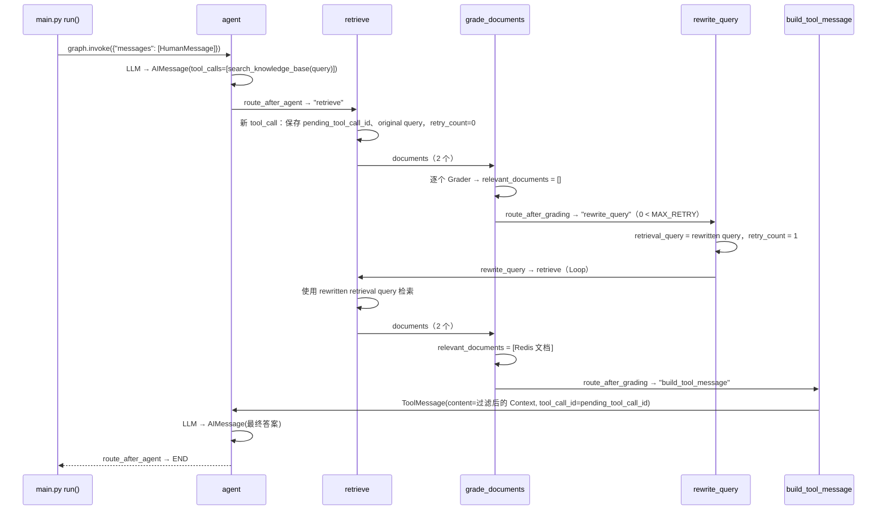

# rag-agent-demo

一个用于**学习 LangChain + LangGraph Agent 编排机制**的最小 Python Demo。

- **Version 1**：用 LangGraph 显式搭建单 Agent 的 Reason → Act → Observe 循环，RAG Retriever 是 Agent 的一个 Tool。
- **Version 2（当前）**：在 Agent 发起检索之后、看到检索结果之前，插入一段 **Corrective RAG Workflow**：
  `Retrieve → Grade Documents → (Query Rewrite → Retrieve)* → ToolMessage`。

```text
rag-agent-demo/
├── data/
│   └── knowledge.md    # 测试知识库（Redis / RAG / Agent 三个主题）
├── rag/
│   ├── __init__.py
│   └── retriever.py    # 索引构建 + retrieve_documents(query) + format_documents(docs)
├── agent/
│   ├── __init__.py
│   ├── state.py        # AgentState：messages + Corrective RAG 的业务状态
│   ├── tools.py        # @tool search_knowledge_base：交给 LLM 的"工具说明书"
│   ├── nodes.py        # 所有 Node / 路由函数 / LLM / Prompt / MAX_RETRY
│   └── graph.py        # 只做编排：加节点、加边、compile
├── main.py             # 程序入口：question → graph.invoke() → 打印结果
├── requirements.txt
├── .env.example
└── README.md
```

模块依赖方向（单向，无循环 import）：

```text
main.py
   ↓
agent/graph.py
   ↓
agent/nodes.py ──→ agent/state.py
   │
   ├──→ agent/tools.py ──→ rag/retriever.py
   └────────────────────→ rag/retriever.py   （retrieve_node 直接调用 retrieve_documents）
```

---

## 1. 运行方式

```bash
cd rag-agent-demo
python3 -m venv .venv && source .venv/bin/activate
pip install -r requirements.txt

cp .env.example .env      # 填入 API Key / Base URL / 模型名
python main.py            # 依次运行 Case 1 ~ Case 4
python main.py "RAG 的五步法是什么？"   # 自定义问题
```

任何 OpenAI-compatible 服务都可以，只要它同时提供 **Chat（支持 tool calling）** 和 **Embedding** 接口。若 Chat 与 Embedding 来自不同服务商，在 `.env` 中额外填写 `EMBEDDING_API_KEY` / `EMBEDDING_BASE_URL`。

### 测试 Case 与预期输出

**Case 1：普通问题** —— `Agent → END`，完全不进入 RAG Workflow

```text
[User] 用一句话介绍一下 Python 这门编程语言。
[Agent] LLM called
[Agent] final answer: Python 是一门……
[Trace] HumanMessage → AIMessage
```

**Case 2：知识库问题，第一次检索成功** —— `Agent → Retrieve → Grade(relevant) → ToolMessage → Agent → END`

```text
[User] 根据知识库，我们团队的 Redis 集群代号是什么？主要用来做什么？
[Agent] LLM called
[Agent] tool_call: search_knowledge_base args={'query': '团队 Redis 集群代号及主要用途'}
[Retrieve] query: 团队 Redis 集群代号及主要用途  (original query from tool_call)
[Retrieve] retrieved 2 documents
[Grader] document 1: relevant
[Grader] document 2: irrelevant
[Grader] 1 relevant documents
[Tool] filtered context (1 documents) written as ToolMessage
[Agent] LLM called again
[Agent] final answer: Redis 集群代号是「青鸟」（Bluebird），主要用于缓存用户会话和接口限流……
[Trace] HumanMessage → AIMessage → ToolMessage → AIMessage
[State] retrieval_query='团队 Redis 集群代号及主要用途' retry_count=0 relevant_documents=1
```

注意 Grader 把 2 个检索结果过滤成了 1 个，LLM 最终只看到 Redis 那一段。

**Case 3：第一次检索可能被带偏，需要 Rewrite** —— 问题里的 "Agent 应用" 会把向量检索引向 Agent / RAG 主题，而答案其实在 Redis 主题里

```text
[User] 根据知识库，我们的 Agent 应用里，用户会话一般存在团队的哪个组件里？
[Agent] tool_call: search_knowledge_base args={'query': 'Agent 应用里用户会话存在哪个组件'}
[Retrieve] query: Agent 应用里用户会话存在哪个组件  (original query from tool_call)
[Retrieve] retrieved 2 documents
[Grader] document 1: irrelevant
[Grader] document 2: irrelevant
[Grader] 0 relevant documents
[Rewrite] original query: Agent 应用里用户会话存在哪个组件
[Rewrite] rewritten query: Agent 应用用户会话存储组件 Redis Session Manager
[Retry] 1 / 1
[Retrieve] query: Agent 应用用户会话存储组件 Redis Session Manager  (rewritten retrieval query)
[Retrieve] retrieved 2 documents
[Grader] 1 relevant documents
[Tool] filtered context (1 documents) written as ToolMessage
[Agent] LLM called again
[Agent] final answer: ……用户会话一般存在 Redis（团队内部代号「青鸟」）中。
[State] retrieval_query='Agent 应用用户会话存储组件 Redis Session Manager' retry_count=1 relevant_documents=1
```

**Case 4：知识库中根本没有的信息** —— Rewrite 一次后仍然没有相关文档，触发 `MAX_RETRY` 终止条件

```text
[User] 根据知识库，我们团队的 Kafka 集群代号是什么？
[Retrieve] query: Kafka 集群代号  (original query from tool_call)
[Grader] 0 relevant documents
[Rewrite] original query: Kafka 集群代号
[Rewrite] rewritten query: 团队 Kafka 集群代号 命名规范
[Retry] 1 / 1
[Retrieve] query: 团队 Kafka 集群代号 命名规范  (rewritten retrieval query)
[Grader] 0 relevant documents
[Retry] max retry reached (1 / 1), stop rewriting
[Tool] no relevant context, ToolMessage: 知识库中没有找到与当前问题足够相关的信息。
[Agent] LLM called again
[Agent] final answer: 团队内部知识库中并未包含关于 Kafka 集群代号的相关信息……
[State] retrieval_query='团队 Kafka 集群代号 命名规范' retry_count=1 relevant_documents=0
```

### 关于随机性（重要）

- **Case 3 不保证每次都进入 Rewrite。** 知识库只有 3 个 chunk，Retriever 取 `k=2`，一次检索就能召回三分之二的内容，所以第一次检索经常已经包含 Redis 那段。实测 7 次中有 2 次进入了 Rewrite，其余几次第一次检索就被判为 relevant，直接走 Case 2 的路径。是否进入 Rewrite 取决于 LLM 生成的 query、Embedding 相似度和 Grader 的判断，这三者都有波动。
- **Case 4 稳定展示** `Retrieve → Grade → Rewrite → Retrieve → Grade → Max Retry` 这条完整路径，因为知识库中确实不存在 Kafka 相关内容。
- 代码中**没有**为了让 Case 3 固定通过而硬编码任何业务判断（比如"问题含 Agent 就判不相关"），Grader 和 Rewrite 完全由 LLM 决定。
- LLM 是否调用工具也由模型自己决定，不同模型的表现可能略有差异。

---

## 2. Version 1 → Version 2 的变化

| | Version 1 | Version 2 |
|---|---|---|
| State | `MessagesState`（只有 `messages`） | 自定义 `AgentState`：`messages` + 5 个业务字段 |
| tool_call 之后 | `tool_node` 立即执行 Tool，立即生成 ToolMessage | `retrieve` → `grade_documents` →（必要时 `rewrite_query` → `retrieve`）→ `build_tool_message` |
| LLM 看到的 Context | Retriever 返回的全部 top-2 文档 | 经过 Grader 过滤后的相关文档，或"没有找到"提示 |
| 条件边 | 1 个：`route_after_agent` | 2 个：`route_after_agent`、`route_after_grading` |
| 循环 | 1 个：Agent Loop（由 LLM 决定是否退出） | 2 个：Agent Loop + Rewrite Loop（由 `retry_count` 决定何时退出） |
| `search_knowledge_base` | 被 Graph 直接执行 | 只作为"工具说明书"交给 LLM；Graph 读取 tool_call，自己执行检索流程 |
| 节点 | `agent`、`tools` | `agent`、`retrieve`、`grade_documents`、`rewrite_query`、`build_tool_message` |

### Version 1 Graph



### Version 2 Graph（对应 `agent/graph.py`）



图中节点名和代码的对应关系：`Agent` = `agent`、`Retrieve` = `retrieve`、`Grade` = `grade_documents`、`Rewrite` = `rewrite_query`、`ToolMessage` = `build_tool_message`。

`agent/graph.py` 中的全部编排代码：

```python
builder.add_edge(START, "agent")
builder.add_conditional_edges("agent", route_after_agent, ["retrieve", END])

builder.add_edge("retrieve", "grade_documents")
builder.add_conditional_edges("grade_documents", route_after_grading, ["build_tool_message", "rewrite_query"])
builder.add_edge("rewrite_query", "retrieve")

builder.add_edge("build_tool_message", "agent")
```

---

## 3. 为什么需要自定义 `AgentState`

Version 1 的 State 只有 `messages`，因为工作流里流转的只有对话消息。

Version 2 的 Corrective RAG Workflow 需要在多个节点之间传递**业务数据**：

| 字段 | 写入者 | 读取者 | 含义 |
|---|---|---|---|
| `messages` | `agent`、`build_tool_message` | `agent`、`retrieve`、Grader / Rewrite（取用户问题） | Agent 对话历史，reducer 为 `add_messages`（追加） |
| `retrieval_query` | `retrieve`（第一次）、`rewrite_query` | `retrieve`、`rewrite_query` | 当前真正用于 Retriever 的 Query |
| `documents` | `retrieve` | `grade_documents` | 当前一次检索得到的原始文档 |
| `relevant_documents` | `grade_documents` | `route_after_grading`、`build_tool_message` | Grader 判断为相关的文档 |
| `retry_count` | `retrieve`（重置为 0）、`rewrite_query`（+1） | `route_after_grading` | 已经 Rewrite 的次数 |
| `pending_tool_call_id` | `retrieve`（第一次） | `retrieve`、`build_tool_message` | Agent 原始 tool_call 的 id |

LangGraph 中 **State 就是节点之间的"共享内存"**，`messages` 只是其中一个字段。除 `messages` 外，其余字段没有 reducer，节点返回新值时会直接**覆盖**旧值，这正是 `retrieval_query`、`retry_count` 这类"当前值"需要的语义。

> 实现说明：`AgentState` 用 `TypedDict` 显式写出了 `messages: Annotated[list[AnyMessage], add_messages]`，效果等同于继承 `MessagesState`。原因是本项目运行在 Python 3.9，继承 `MessagesState` 时 LangGraph 解析父类类型注解会报 `NameError`。

## 4. 为什么 documents 不应该全部只存在 `messages` 里

- **`messages` 是给 LLM 看的。** Agent Node 每次都会把 `SystemMessage + messages` 全部发给 LLM。把被 Grader 淘汰的文档、第一次失败的检索结果放进 `messages`，LLM 就会看到这些噪音，这恰恰是 Grader 想避免的。
- **`messages` 必须符合协议格式。** 每个 tool_call 后面必须恰好跟一个对应的 ToolMessage。中间的检索、评分、改写不是对话的一部分，硬塞进 `messages` 会破坏这个结构。
- **结构化数据更易使用。** `documents` 是 `list[Document]`，Grader 可以逐个判断；`retry_count` 是 `int`，路由函数可以直接比较。如果把它们拼成字符串塞进 `messages`，后续节点还得重新解析。
- **追加和覆盖的语义不同。** `messages` 只追加不覆盖；`documents` 每次检索都应该被**替换**成新的结果。

## 5. Retrieval Grader 的作用

向量检索只保证"相似"，不保证"有用"。`k=2` 时即使只有 1 个文档相关，Retriever 也会返回 2 个。

`grade_documents_node` 对每个文档调用一次 LLM：

```text
用户问题 + 文档内容 → grader_llm（with_structured_output(GradeResult)）→ relevant: true / false
```

它有两个作用：

1. **过滤噪音**：只把相关文档交给 Agent（Case 2 中 2 个文档被过滤成 1 个）；
2. **提供路由信号**：`relevant_documents` 是否为空，决定下一步去 `build_tool_message` 还是 `rewrite_query`。

使用 Structured Output（Pydantic `GradeResult`）意味着 LLM 必须返回 `{"relevant": true/false}`，代码可以直接 `if result.relevant`，不需要解析自由文本。

## 6. Query Rewrite 的作用

Agent 在 tool_call 里写的 query 是 LLM 根据用户问题"顺手"生成的，不一定适合向量检索，比如带有误导性的词（Case 3 的 "Agent 应用"），或者表达太模糊。

`rewrite_query_node` 根据**用户原始问题 + 当前 retrieval_query** 生成一个新的检索 Query：

- 只生成 Query，**不回答问题**；
- 写入 `retrieval_query`（覆盖），`retry_count += 1`；
- 下一次进入 `retrieve_node` 时，使用的是 `state["retrieval_query"]`（rewritten retrieval query），而不是 tool_call 里的 original query。

## 7. `retry_count` 为什么属于 Stop Condition

`rewrite_query → retrieve → grade_documents → rewrite_query → ...` 是一个环。如果知识库里根本没有答案（Case 4），无论怎么改写都不会出现相关文档，这个环就永远不会自然结束。

所以必须有一个**不依赖 LLM 判断**的退出条件：

```python
MAX_RETRY = 1   # agent/nodes.py

def route_after_grading(state):
    if state["relevant_documents"]:
        return "build_tool_message"   # 出口 1：找到了
    if state["retry_count"] < MAX_RETRY:
        return "rewrite_query"        # 继续循环
    return "build_tool_message"       # 出口 2：重试次数用完
```

`retry_count` 每 Rewrite 一次加 1，并且只在 Agent 发起一个**新的** tool_call 时重置为 0。所以每次检索请求最多 Rewrite `MAX_RETRY` 次。

Agent Loop 的出口由 LLM 决定（不再产生 tool_call），Rewrite Loop 的出口则由**代码中的计数器**保证。LangGraph 的 `recursion_limit=25` 只是最后一道安全网。

## 8. `rewrite → retrieve` 为什么构成一个 LangGraph Loop

```python
builder.add_edge("retrieve", "grade_documents")                         # ①
builder.add_conditional_edges("grade_documents", route_after_grading,
                              ["build_tool_message", "rewrite_query"])  # ②
builder.add_edge("rewrite_query", "retrieve")                           # ③
```

① → ② 选择 `rewrite_query` → ③ 回到 `retrieve`，三条边首尾相接形成一个环。

LangGraph 的 Graph 本来就允许有环，并不是 DAG。每走一圈，State 中的 `retrieval_query`、`documents`、`relevant_documents`、`retry_count` 都会被更新，下一圈的路由函数读取的是**新的 State**。这就是"循环"在 LangGraph 中的含义：**同一组节点 + 不断变化的 State + 条件边决定是否继续**。

## 9. 为什么最终仍然需要 ToolMessage

Agent Node 和 LLM 交互的唯一通道是 `messages`。

- LLM 上一轮输出了一条带 `tool_calls` 的 AIMessage，OpenAI 协议规定：下一次请求中，这条 AIMessage 后面**必须**紧跟与每个 tool_call 对应的 ToolMessage，否则接口会直接报错。
- 从 LLM 的视角看，它只是"调用了一次 `search_knowledge_base`，拿到了结果"。中间的 Grade / Rewrite / Retry 对它是透明的。
- 所以 Workflow 的最终产物必须"翻译"回 ToolMessage，Agent 才能基于它生成最终回答。这就是 `build_tool_message_node` 存在的意义，最终答案仍然由 Agent Node 生成。

## 10. ToolMessage 的 `tool_call_id` 为什么必须和原始 tool call 对应

AIMessage 中的每个 tool_call 都有一个唯一 `id`（如 `call_abc123`），ToolMessage 通过 `tool_call_id` 声明"我是哪个 tool_call 的结果"。

- 协议层面：`tool_call_id` 对不上，OpenAI 兼容接口会报错（"tool_call_id ... not found"）；
- 语义层面：一条 AIMessage 可以有多个 tool_call，`tool_call_id` 是 LLM 把结果和请求对应起来的唯一依据。

Version 1 中 `tool_node` 当场就能拿到 `tool_call["id"]`。Version 2 中 ToolMessage 要经过 `retrieve → grade → rewrite → retrieve → grade` 好几个节点后才生成，所以 `retrieve_node` 第一次进入时必须先把 id 存进 `pending_tool_call_id`，`build_tool_message_node` 最后再取出来使用。

> 为了让 `pending_tool_call_id` 只需要保存一个值，`bind_tools(tools, parallel_tool_calls=False)` 要求 LLM 每次只发起一个 tool_call。

---

## 11. 一次完整请求经过的 Node（Case 3，发生 Rewrite 时）



---

## 小技巧

查看 LangGraph 实际编译出的图结构（import 时会执行索引阶段，需已配置 `.env`）：

```python
from agent.graph import graph
print(graph.get_graph().draw_mermaid())
```
