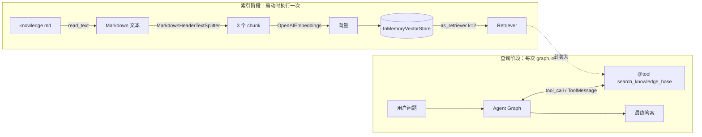
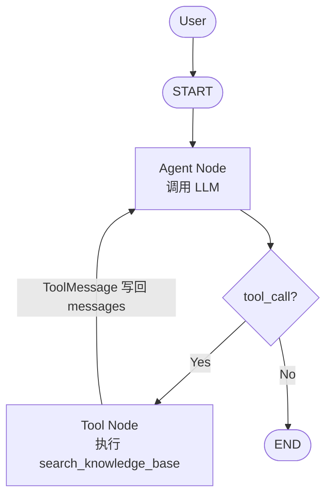
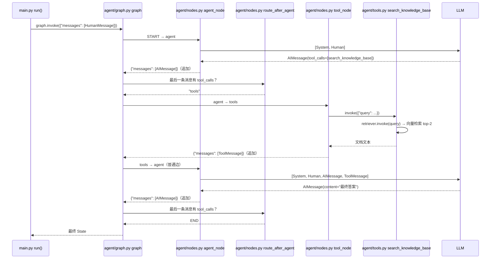

# rag-agent-demo

一个用于**学习 Agent 编排机制**的最小 Python Demo：用 LangGraph **显式**搭建单 Agent 的 Reason → Act → Observe 循环，并把 RAG Retriever 作为 Agent 的一个 Tool。

代码按职责拆分为几个小模块，每个模块只做一件事：

```text
rag-agent-demo/
├── data/
│   └── knowledge.md    # 测试知识库（Redis / RAG / Agent 三个主题）
├── rag/
│   ├── __init__.py
│   └── retriever.py    # build_retriever()：加载 → 切分 → Embedding → InMemoryVectorStore → Retriever
├── agent/
│   ├── __init__.py
│   ├── tools.py        # @tool search_knowledge_base：调用 Retriever 返回文档内容
│   ├── nodes.py        # LLM / bind_tools / SYSTEM_PROMPT + agent_node / tool_node / route_after_agent
│   └── graph.py        # 只做编排：StateGraph 加节点、加边、compile
├── main.py             # 程序入口：question → graph.invoke() → 打印结果
├── requirements.txt
├── .env.example
└── README.md
```

模块依赖方向（单向，无循环 import）：

```text
main.py
   ↓
agent/graph.py
   ↓
agent/nodes.py
   ↓
agent/tools.py
   ↓
rag/retriever.py
```

---

## 1. 运行方式

```bash
cd rag-agent-demo
python3 -m venv .venv && source .venv/bin/activate
pip install -r requirements.txt

cp .env.example .env      # 填入 API Key / Base URL / 模型名
python main.py            # 依次运行 Case 1、Case 2
python main.py "RAG 的五步法是什么？"   # 自定义问题
```

任何 OpenAI-compatible 服务都可以，只要它同时提供 **Chat（支持 tool calling）** 和 **Embedding** 接口。若 Chat 与 Embedding 来自不同服务商，在 `.env` 中额外填写 `EMBEDDING_API_KEY` / `EMBEDDING_BASE_URL`。

### 预期输出

**Case 1：普通问题** —— Agent 不调用 Retriever，直接回答

```text
[User] 用一句话介绍一下 Python 这门编程语言。
[Agent] LLM called
[Agent] final answer: Python 是一种……
[Trace] HumanMessage → AIMessage
```

**Case 2：知识库问题** —— Agent 发起 tool_call，基于检索内容回答

```text
[User] 根据知识库，我们团队的 Redis 集群代号是什么？主要用来做什么？
[Agent] LLM called
[Agent] tool_call: search_knowledge_base args={'query': '团队 Redis 集群代号 用途'}
[Tool] query: 团队 Redis 集群代号 用途
[Tool] retrieved 2 documents
[Tool] 1 ToolMessage written back to messages
[Agent] LLM called again
[Agent] final answer: 团队 Redis 集群代号是「青鸟」（Bluebird），主要用于缓存用户会话和接口限流……
[Trace] HumanMessage → AIMessage → ToolMessage → AIMessage
```

「青鸟」是知识库里编造的事实，模型不可能事先知道——答案里出现它，就说明回答确实来自检索结果。

> LLM 是否调用工具由模型自己决定，不同模型的表现可能略有差异。

---

## 2. 整体数据流

分为两个阶段：**索引阶段**（程序启动时执行一次，即 `agent/tools.py` 被 import 时调用 `build_retriever()`）和**查询阶段**（每次 `graph.invoke()`）。



Agent Graph 本身的结构（对应 `agent/graph.py`）：



---

## 3. `State` 是什么

State 是**图中所有节点共享的一份数据**。每个节点读取 State，返回一个"更新"，LangGraph 负责把更新合并进 State，再交给下一个节点。

本 Demo 使用 LangGraph 内置的 `MessagesState`，它等价于：

```python
class MessagesState(TypedDict):
    messages: Annotated[list[AnyMessage], add_messages]
```

关键在 `add_messages`：它是一个 **reducer**，节点返回 `{"messages": [新消息]}` 时，新消息被**追加**到列表末尾，而不是覆盖整个列表。

因此 `messages` 就是 Agent 的"工作记忆"，一次 Case 2 请求结束时它长这样：

| # | 类型 | 由谁产生 | 内容 |
|---|------|---------|------|
| 0 | `HumanMessage` | `graph.invoke()` 的输入 | 用户问题 |
| 1 | `AIMessage` | Agent Node | `content=""`, `tool_calls=[{name, args, id}]` |
| 2 | `ToolMessage` | Tool Node | 检索到的文档文本，`tool_call_id` 对应 #1 |
| 3 | `AIMessage` | Agent Node | 最终答案，`tool_calls=[]` |

---

## 4. `Agent Node` 是什么（Reason）

`agent_node(state)` 就是一个普通 Python 函数：

1. 把 `SystemMessage + state["messages"]` 全部发给 LLM；
2. LLM 已通过 `bind_tools` 拿到了工具的 JSON Schema（来自 `@tool` 函数的名字、参数和 docstring）；
3. LLM 返回一个 `AIMessage`，它**要么**带 `tool_calls`（"我需要先查资料"），**要么**带最终答案文本；
4. 返回 `{"messages": [response]}`，追加进 State。

注意：**Agent Node 自己不执行工具**。LLM 只是"说"它想调用哪个工具、传什么参数——执行工具是 Tool Node 的事。

---

## 5. `Tool Node` 是什么（Act + Observe）

`tool_node(state)` 读取最后一条 `AIMessage` 的 `tool_calls`，对每一个：

1. 按名字找到对应的工具函数；
2. 用 LLM 给出的参数调用它（这里就是执行一次向量检索）；
3. 把结果包装成 `ToolMessage(content=结果, tool_call_id=...)`。

返回 `{"messages": tool_messages}` 后，检索结果就进入了 `messages`，下一轮 LLM 就能"看到"它——这就是 **Observe**。

`tool_call_id` 用来把 `ToolMessage` 和发起它的那个 `tool_call` 对应起来，OpenAI 协议要求必须匹配。

> 这段手写逻辑等价于 LangGraph 内置的 `ToolNode(tools)`。理解后可以把
> `builder.add_node("tools", tool_node)` 换成 `builder.add_node("tools", ToolNode(tools))`（`from langgraph.prebuilt import ToolNode`）。

---

## 6. 为什么 `Conditional Edge` 能形成 Agent Loop

`agent/graph.py` 里只有三条边：

```python
builder.add_edge(START, "agent")                                           # ①
builder.add_conditional_edges("agent", route_after_agent, ["tools", END])  # ②
builder.add_edge("tools", "agent")                                         # ③
```

- **②** 是条件边：Agent Node 执行完后，LangGraph 调用 `route_after_agent(state)`，根据**最后一条消息有没有 `tool_calls`** 决定下一步去 `"tools"` 还是 `END`；
- **③** 是普通边：Tool Node 执行完后**无条件**回到 Agent。

② 和 ③ 合起来构成了一个环：`agent → tools → agent → tools → ...`。

这个环的**出口只有一个**：LLM 某一次不再产生 `tool_call`，而是直接给出答案，此时 ② 走向 `END`。

所以"要不要继续循环"不是写死在代码里的，而是**由 LLM 在每一轮自行决定**——这正是 Agent 与固定流程（Chain）的本质区别。

> 安全网：LangGraph 默认 `recursion_limit=25`，若模型一直调用工具，超过步数会抛出 `GraphRecursionError`，不会无限循环。

---

## 7. 一次完整请求的执行顺序（Case 2）



Case 1 只走前半段：`agent_node` → `route_after_agent` 返回 `END` → 结束。

---

## 小技巧

查看 LangGraph 实际编译出的图结构（import 时会执行索引阶段，需已配置 `.env`）：

```python
from agent.graph import graph
print(graph.get_graph().draw_mermaid())
```
