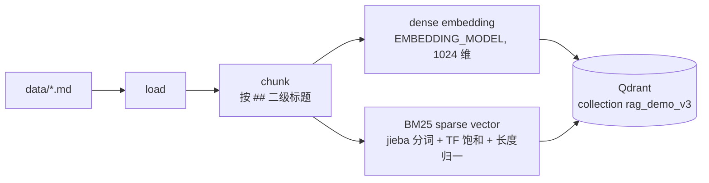
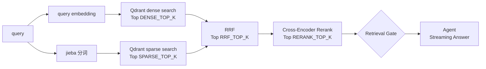
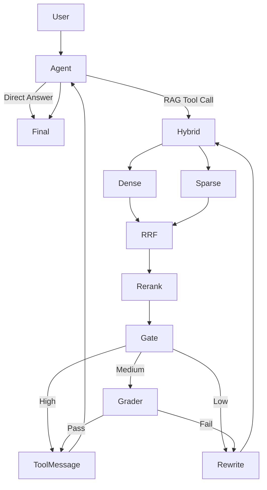

# rag-agent-demo

一个用于**学习 LangChain + LangGraph Agent 编排与 RAG 工程**的 Python Demo，按版本逐步演进：

| 版本 | 核心链路 | 学习重点 |
|---|---|---|
| Version 1 | `Agent ↔ Tool` | Tool Calling、Agent Loop |
| Version 2 | `Retrieve → Grade → Rewrite → Retry` | State、Node、Conditional Edge、Loop、Stop Condition |
| **Version 3（当前）** | `Hybrid Retrieval → RRF → Rerank → Confidence Gate → Streaming → Observability → Evaluation` | RAG Engineering、Retrieval Quality、Latency Analysis、Evaluation |

核心原则：**LangGraph 负责业务流程编排；RAG 模块内部负责检索 pipeline。**

```text
rag-agent-demo/
├── data/                   # 知识库：7 篇 Markdown（redis / rag / agent / deploy / oncall / mysql / api）
├── config.py               # 集中配置：模型、Qdrant、Top-K、RRF、Gate 阈值、MAX_RETRY（均可被 .env 覆盖）
├── rag/                    # 检索层（不依赖 agent）
│   ├── store.py            #   Qdrant 连接、Point 数据模型
│   ├── indexing.py         #   Offline：load → chunk → dense embedding → BM25 sparse → Qdrant
│   ├── dense_retriever.py  #   query embedding + Qdrant dense search
│   ├── sparse_retriever.py #   jieba 分词 + BM25 sparse vector + Qdrant sparse search
│   ├── fusion.py           #   Reciprocal Rank Fusion
│   ├── reranker.py         #   Cross-Encoder Reranker（bge-reranker-base，本地 ONNX）
│   ├── gate.py             #   Retrieval Gate：HIGH / MEDIUM / LOW
│   └── pipeline.py         #   Online：retrieve(query) = Dense + Sparse → RRF → Rerank
├── agent/                  # 编排层
│   ├── state.py            #   AgentState（V2 字段 + gate_level / top_rerank_score）
│   ├── tools.py            #   search_knowledge_base：交给 LLM 的"工具说明书"
│   ├── nodes.py            #   Node / 路由 / LLM / Prompt；Agent 流式输出与 TTFT 打点
│   └── graph.py            #   只做编排：加节点、加边、compile
├── observability/
│   └── metrics.py          # perf_counter 阶段计时、TTFT、Performance Report
├── scripts/
│   └── build_index.py      # Offline Indexing 入口
├── eval/
│   ├── dataset.json        # 24 条 query → relevant_chunk_ids
│   └── run_eval.py         # Recall@K / MRR / latency avg-p50-p95
├── main.py                 # Online Query 入口：流式回答 + Performance Report
├── docker-compose.yml      # 单节点 Qdrant，数据挂载到 ./qdrant_storage
├── requirements.txt
└── .env.example
```

模块依赖方向（单向，无循环 import）：

```text
main.py ──→ agent/graph.py ──→ agent/nodes.py ──→ rag/pipeline.py ──→ dense / sparse / fusion / reranker ──→ rag/store.py ──→ Qdrant
                                    │                rag/gate.py
                                    └──→ agent/state.py, agent/tools.py
observability/metrics.py ← 被 rag、agent、main 调用（它自己不 import 任何业务模块）
config.py                ← 被所有模块读取
```

`rag/` 中没有任何 `import agent`。rag 层通过 `ContextVar` 拿到当前请求的 metrics 对象，不需要 agent 把 metrics 作为参数传进来。

---

## 1. 运行方式

```bash
cd rag-agent-demo
python3 -m venv .venv && source .venv/bin/activate
pip install -r requirements.txt
cp .env.example .env                 # 填入 API Key / Base URL / 模型名

# 1) 启动 Qdrant（REST 6333 / gRPC 6334，数据持久化在 ./qdrant_storage）
docker compose up -d

# 2) Offline Indexing：构建完成后退出；文档变更后重新运行
python scripts/build_index.py

# 3) Online Query：只读已有索引，不会重新做文档 Embedding
python main.py                       # 依次运行内置的 5 个 Case
python main.py "灰度发布分几个阶段？"   # 自定义问题

# 4) Offline Evaluation
python eval/run_eval.py              # 检索评测 + 端到端评测（会调用 Chat 模型）
python eval/run_eval.py --no-e2e     # 只跑检索评测
```

- 首次运行会从 HuggingFace 下载 Reranker 模型 `BAAI/bge-reranker-base`（约 1 GB），之后从 `~/.cache/fastembed` 加载。
- Qdrant Dashboard：<http://localhost:6333/dashboard>。`docker compose down && docker compose up -d` 后，索引仍然存在。
- 在线进程启动时会先 `warmup()`：检查 collection 是否存在，加载 Reranker 和 jieba 词典。这些时间不计入任何一次请求的 latency。

---

## 2. Indexing Pipeline 与 Query Pipeline

V2 在 `import rag.retriever` 时就会把全部文档重新 Embedding 一遍，写进 `InMemoryVectorStore`，进程退出后索引就丢了。V3 把这条链路拆成两条独立的 Pipeline：

### Offline Indexing Pipeline（`python scripts/build_index.py`）



实测：7 篇文档 → 19 个 chunk，总耗时约 1.6 s，其中 dense embedding 约 1.0 s。

### Online Query Pipeline（`python main.py "问题"`）



在线进程只对 **query 本身**做一次 Embedding，不会读取 `data/`，也不会 import `rag/indexing.py`。

### Qdrant Point 结构

一个 chunk 对应一个 Point：

```json
{
  "id": "uuid5(chunk_id)",
  "vector": {
    "dense": [0.0123, -0.0456, "... 共 1024 维"],
    "bm25":  {"indices": [190934187, 2836301834, "..."], "values": [1.58, 1.21, "..."]}
  },
  "payload": {
    "document_id": "redis",
    "chunk_id": "redis_001",
    "source": "data/redis.md",
    "title": "Redis 使用手册",
    "topic": "Redis 的用途",
    "text": "## Redis 的用途\n\nRedis 是一个基于内存的 Key-Value 数据库……"
  }
}
```

- `dense`：Named dense vector，Cosine 距离。
- `bm25`：Named sparse vector，collection 配置为 `modifier=IDF`，IDF 由 Qdrant 根据当前 collection 统计；文档侧的 value 只存 BM25 的 TF 部分。
- `id`：用 `chunk_id` 计算 uuid5，同一个 chunk 每次重建索引得到的 id 都相同。

---

## 3. Version 3 完整 Graph



上图省略了 Stop Condition：`retry_count` 达到 `MAX_RETRY` 后，Low 和 Grader Fail 都会直接进入 ToolMessage（内容为"没找到"），不再 Rewrite。

LangGraph 中实际的节点（`agent/graph.py`）比上图少。Hybrid、Dense、Sparse、RRF、Rerank、Gate 都在 `retrieve` 这一个 Node 里，由 `rag.pipeline.retrieve()` 和 `rag.gate.retrieval_gate()` 完成：

```python
builder.add_edge(START, "agent")
builder.add_conditional_edges("agent", route_after_agent, ["retrieve", END])

builder.add_conditional_edges("retrieve", route_after_gate, ["build_tool_message", "grade_documents", "rewrite_query"])
builder.add_conditional_edges("grade_documents", route_after_grading, ["build_tool_message", "rewrite_query"])
builder.add_edge("rewrite_query", "retrieve")

builder.add_edge("build_tool_message", "agent")
```

和 V2 相比，编排只改了一处：`retrieve` 之后不再固定进入 `grade_documents`，而是由 `route_after_gate` 分成三路。

---

## 4. Hybrid Retrieval

| | Dense | Sparse / BM25 |
|---|---|---|
| 擅长 | **语义召回**：同义改写、换种说法（"撤回版本" ≈ "回滚"） | **关键词召回**：专有名词、代号、错误码（`AUTH-4031`、`Egret`、`KEYS`） |
| 实现 | `embed_query()` → Qdrant `query_points(using="dense")` | `jieba.lcut_for_search` → `{token_id: 1.0}` → Qdrant `query_points(using="bm25")` |
| 分数 | Cosine，0~1 | BM25，0~十几，无上界 |

BM25 公式拆成两部分，分别在两个时机计算：

```text
BM25(q, d) = Σ_{t∈q}  IDF(t)  ·  tf·(k1+1) / (tf + k1·(1 − b + b·|d|/avgdl))
                      └Qdrant┘   └─────────── 离线算好，作为文档 sparse vector 的 value ───────────┘
```

- 文档侧（离线）：分词后统计 tf，用 `avgdl` 计算 TF 饱和和长度归一化。
- 查询侧（在线）：每个 query 词的权重是 1.0，Qdrant 做点积时再乘以它维护的 IDF。在线查询不需要扫描文档，也不需要 `avgdl`。
- `token_id`：取词的 md5 前 32 位，不需要维护词表文件。

## 5. RRF Fusion（`rag/fusion.py`）

```python
for source, documents in ranked_lists.items():          # dense / sparse
    for rank, doc in enumerate(documents, start=1):
        scores[chunk_id] += 1.0 / (k + rank)             # k = RRF_K = 60
```

Cosine 的取值是 0~1，BM25 是 0~十几且没有上界。如果用 `0.7 * dense + 0.3 * bm25` 直接加权，结果主要由 BM25 的量纲决定。RRF 只看名次：两路都排在前面的文档得分最高，只出现在一路里的文档也能拿到 `1/(k+rank)`。

## 6. Reranker（`rag/reranker.py`）

```python
rerank(query, documents, top_k=5) -> list[RerankResult(document, rerank_score)]
```

- 模型：`BAAI/bge-reranker-base`，中英双语 Cross-Encoder，通过 `fastembed` 以 ONNX Runtime 在本地 CPU 上运行，不需要 GPU，也不需要 PyTorch。
- Embedding 是 Bi-Encoder：query 和文档分别编码，再计算相似度。Cross-Encoder 把 `(query, document)` 拼成一个输入，能看到两者逐词的交互，所以排序更准；代价是每个候选都要跑一次模型，只适合对 RRF Top N 做精排。
- 模型输出的是 logit，经过 sigmoid 映射到 `[0, 1]`，作为 `rerank_score` 交给 Gate 使用。
- 要换模型，实现同样签名的 `rerank()` 并在 `get_reranker()` 里返回即可（见 `Reranker` Protocol）。

## 7. Retrieval Gate（`rag/gate.py`）与 LLM Grader 职责变化

```text
top1 = 最高 rerank_score

top1 ≥ HIGH_CONFIDENCE_THRESHOLD (0.9)        → HIGH   ：score ≥ HIGH 的文档直接进入 ToolMessage，不调用 LLM
LOW ≤ top1 < HIGH                              → MEDIUM ：score ∈ [LOW, HIGH) 的文档交给 LLM Grader 逐个判断
top1 < LOW_CONFIDENCE_THRESHOLD (0.15) 或为空   → LOW    ：直接 Query Rewrite；重试次数用完则返回"没找到"
```

> **当前阈值仅为 Demo 初始值**，来自本仓库这个小知识库在 bge-reranker-base 上观察到的分数分布：明确问题 top1 ≥ 0.98，模糊问题在 0.17~0.86，跑偏或知识库里没有的问题 ≤ 0.12。它们没有普适性，换语料、换模型都要重新调。**正式系统应根据 Eval Dataset 的分数分布调参。**

| | Version 2 | Version 3 |
|---|---|---|
| 谁来判断相关性 | **每一次检索的每一个文档**都调用 LLM Grader | Reranker 分数先过 Gate；**只有 MEDIUM** 的文档才调用 LLM Grader |
| LLM Grader 调用量 | Top-K 个 / 每次检索 | 实测 24 条评测 query 中只有 3 条请求触发了 Grader |
| Query Rewrite 触发 | Grader 判定 0 个相关 | Gate 判为 LOW，或者 MEDIUM 时 Grader 判定 0 个相关 |

这体现的是一种分工：**确定性的专用模型（Cross-Encoder）负责主路径，LLM 只处理边界上的语义判断。** 高分直接放行、低分直接重写，两头都省掉了 LLM 调用的延迟和成本。中间那一段是 Reranker 自己也拿不准的区间，才交给 LLM 判断。

`MAX_RETRY = 1` 继续作为 Stop Condition。`retry_count` 只在 Agent 发起新的 tool_call 时重置，Rewrite Loop 不会无限循环。

---

## 8. Observability（`observability/metrics.py`）

只用 `time.perf_counter()`。每个请求有一个 `RequestMetrics`，记录两类数据：

- **stages**：阶段耗时，由 `with timer("dense_retrieval"):` 记录。同一阶段可以执行多次（Rewrite 后会再检索一次），报告显示总和和次数，例如 `(x2)`。
- **marks**：时间点。TTFT、total 由两个时间点相减得到，**不是各阶段相加**。

| 指标 | 开始 | 结束 | 代码位置 |
|---|---|---|---|
| `agent_decision` | Agent 发起产出 tool_call 的那次 LLM 请求 | 该请求的流结束 | `agent_node` |
| `hybrid_retrieval` | 进入 `retrieve()` | RRF 完成（包含下面 4 项的墙钟时间） | `rag/pipeline.py` |
| `query_embedding` | 调用 Embedding API | 拿到 query 向量 | `dense_retriever.embed_query` |
| `dense_retrieval` | 向 Qdrant 发起 dense 查询 | 返回结果 | `dense_retriever.dense_search` |
| `sparse_retrieval` | 开始 jieba 分词 | Qdrant sparse 查询返回 | `sparse_retriever.sparse_search` |
| `rrf_fusion` | 开始融合 | 融合排序完成 | `rag/pipeline.py` |
| `rerank` | Cross-Encoder 开始打分 | 排序截断完成 | `rag/reranker.rerank` |
| `retrieval_gate` | 读取 rerank_score | 得到 HIGH / MEDIUM / LOW | `rag/gate.py` |
| `llm_grader` | 第一个 Grader 请求发出 | 最后一个 Grader 请求返回 | `grade_documents_node` |
| `query_rewrite` | Rewrite 请求发出 | 返回新 query | `rewrite_query_node` |
| `build_tool_message` | 开始拼 Context | ToolMessage 构造完成 | `build_tool_message_node` |
| `final_llm` | 最终回答的 LLM 请求发出 | 该请求的最后一个 chunk | `agent_node` |
| `model_ttft` | `final_llm_start` | `final_first_token`：该请求的第一个文本 token | `agent_node` |
| `generation` | `final_first_token` | `final_llm_end` | `agent_node` |
| `e2e_ttft` | `request_start`：`main.ask()` 收到 Query | `first_visible_token`：第一个回答 token **打印到终端之后** | `main.ask` |
| `total` | `request_start` | `request_end`：Graph 流结束 | `main.ask` |

报告里 `skipped` 表示**这个阶段没有执行**；执行了但很快会显示具体数值，例如 `0.012 ms`。两者不会混淆。

`total` 是墙钟时间。现在各阶段是串行的，各项加起来接近 `total`，但两者的定义不同。以后如果 Dense 和 Sparse 并行执行，各项相加会**大于** `total`，所以代码里从不用"阶段相加"来计算 `total`。

### TTFT：Model TTFT 与 E2E TTFT

```text
request_start ──agent_decision(tool_call)──retrieval──rerank──[grader]──[rewrite]──final_llm_start──prefill──first token──decode──end
│                                                                                  │                        │
│                                                                                  └────── model_ttft ──────┤
└────────────────────────────────────────── e2e_ttft ───────────────────────────────────────────────────────┘
```

- **Model TTFT** = `first_final_token_time − final_llm_start_time`：只衡量最终回答那一次 LLM 请求的排队和 prefill 时间。
- **E2E TTFT** = `first_visible_answer_token_time − request_start_time`：用户从提问到看到第一个回答字，中间所有环节都算在内，包括 Agent 路由、检索、Rerank、Grader、Rewrite 和最终 prefill。

**怎样保证 Agent 的 tool_call 不被计入 TTFT：**

1. 一次 LLM 调用要看到输出才知道是 tool_call 还是回答。`agent_node` 对每次调用都先记录 `call_start`，再根据**第一个有意义的 chunk** 分类：带 `tool_call_chunks` 的是内部决策，耗时记为 `agent_decision`，不产生任何标记；带文本 `content` 的才是最终回答，这时才把 `call_start` 记为 `final_llm_start`，并把当前时刻记为 `final_first_token`。
2. 只有被判为回答的文本 chunk，才会通过 LangGraph 的 `get_stream_writer()` 推送到 `stream_mode="custom"`。tool_call chunk、Grader 和 Rewrite 的 structured output 永远不会进入这条流。`main.py` 只消费这条流，看到第一个 token **打印出来之后**才记录 `first_visible_token`。
3. 兜底：如果模型先输出一段文字、再发起 tool_call，`agent_node` 会发出 `retract` 事件，并清除已记录的 TTFT 标记，等真正的最终回答再重新记录。

Case 1（直接回答）中没有单独的 `agent_decision`：决策和回答是同一次 LLM 调用，报告里显示 `n/a`，耗时都在 `final_llm` 里。

---

## 9. 测试 Case（`python main.py`，以下为一次真实运行的输出摘录）

**Case 1：普通问题**：`Agent → Direct Answer`，不进入 RAG

```text
[Agent] LLM called
[Assistant] Python 是一门强调代码可读性和简洁语法的高级通用编程语言……
hybrid_retrieval / rerank / llm_grader ... skipped
final_llm 1196.7 ms | model_ttft 678.5 ms | e2e_ttft 680.0 ms | total 1199.3 ms
```

**Case 2：清晰的知识库问题**：`Hybrid → Rerank → HIGH → ToolMessage`，**不调用 LLM Grader**

```text
[Agent] tool_call: search_knowledge_base args={'query': 'Redis 集群代号和用途'}
[Retrieve] dense  top: redis_001(0.681), redis_003(0.447), rag_003(0.424), ...
[Retrieve] sparse top: redis_001(9.829), rag_003(4.285), redis_003(2.392), ...
[Retrieve] rrf    top: redis_001(0.033), redis_003(0.032), rag_003(0.032), ...
[Rerank]   top: redis_001(1.000), rag_003(0.132), redis_002(0.034), ...
[Gate] HIGH (top rerank_score=1.000, high>=0.9, low<0.15) → pass 1 documents
[Assistant] 根据知识库，我们团队的 Redis 集群代号是「青鸟」（Bluebird）……
agent_decision 920.0 | hybrid_retrieval 356.3 | rerank 313.2 | llm_grader skipped | model_ttft 887.0 | e2e_ttft 2480.8 | total 2821.7 (ms)
```

**Case 3：模糊问题**："我们这边一般怎么上线？" → `MEDIUM → LLM Grader`

```text
[Rerank]   top: deploy_001(0.883), deploy_003(0.169), deploy_002(0.098), ...
[Gate] MEDIUM (top rerank_score=0.883) → 2 documents to LLM Grader
[Grader] deploy_001: relevant / deploy_003: irrelevant
```

**Case 4：检索被带偏**："Agent 应用里用户会话存在哪个组件" → `LOW → Rewrite → Retry → MEDIUM → Grader`

```text
[Rerank]   top: redis_001(0.147), agent_001(0.022), ...
[Gate] LOW (top rerank_score=0.147)
[Rewrite] rewritten query: Agent 应用用户会话数据存储在哪个内部组件
[Retry] 1 / 1
[Rerank]   top: redis_001(0.459), ...
[Gate] MEDIUM → [Grader] redis_001: relevant
hybrid_retrieval (x2) | rerank 832.8 ms (x2) | llm_grader 575.9 | query_rewrite 1399.1 | e2e_ttft 4999.5 | total 5286.7 (ms)
```

**Case 5：知识库中不存在**（Kafka）→ `LOW → Rewrite → MEDIUM → Grader(0) → Max Retry → "没找到"`

**关于随机性**：Agent 写进 tool_call 的 query、Rewrite 生成的 query 和 Grader 的判断都来自 LLM，每次运行可能不同，所以 Case 3、4 不保证每次都走同一条路径。例如另一次运行中，Case 3 的 Agent 把 query 写成了"发布流程 上线 灰度 回滚"，top1 = 0.937，直接走了 HIGH。代码里没有为了让某个 Case 固定通过而写任何业务判断。

---

## 10. Offline Evaluation（`python eval/run_eval.py`）

`eval/dataset.json`：

```json
[{"query": "团队 Redis 集群主要用于什么？", "relevant_chunk_ids": ["redis_001"]}, ...]
```

- `Recall@K = |relevant ∩ TopK| / |relevant|`
- `MRR = mean(1 / 第一个正确结果的排名)`，Top N 中没有命中记为 0

评测会分别计算 dense、sparse、hybrid_rrf、hybrid_rerank 四个阶段的排序，可以直接看出每一步带来了什么。端到端部分会把每条 query 都走一遍完整 Agent Graph，统计 e2e latency、TTFT 和 Gate 分布。

一次实际运行的结果（Embedding / Chat 为公网 API，Reranker 在本机 CPU 上运行）：

```text
stage              Recall@1   Recall@3   Recall@5      MRR
dense                 1.000      1.000      1.000    1.000
sparse                0.917      0.958      0.958    0.938
hybrid_rrf            0.958      0.958      0.958    0.965
hybrid_rerank         0.958      1.000      1.000    0.979

Retrieval Latency (ms)   avg     p50     p95
hybrid_retrieval       155.2   127.7   295.1
rerank                 354.4   398.0   421.7
retrieval_total        509.6   529.2   616.2

End-to-End (ms)          avg     p50     p95      max
total                 5617.8  2869.6  6832.1  62474.3
e2e_ttft              4795.9  2224.4  5691.7  62056.1
model_ttft            3112.7   586.8  1030.8  60472.7
```

怎么读这组数据：

- 语料很小，Dense 已经满分，Hybrid 在这个数据集上**没有提升**，RRF 还被 BM25 的一次排序失误拉低了 Recall@1。这个结果符合预期：Hybrid 的价值在大语料、专有名词多的场景下才明显。数据集越小，越要避免把 Demo 结果外推到生产。
- avg 被一次偶发的 Chat API 卡顿拉高：第 15 条 query 的最终回答等首 token 等了 60.47 s，这就是 `model_ttft` 的 max 值。同一条 query 复测 10 次都在 0.75 s 以内。当时配置是 `timeout=60`，一次卡顿最长可以等满一分钟；现在已改为 `API_TIMEOUT=5, API_MAX_RETRIES=3`（见 `config.py`）。p50 更能代表典型情况，这也是延迟统计要看分位数、不能只看平均值的原因。

> 数据集只有 24 条，语料只有 19 个 chunk，**p95 仅用于 Demo，不具备生产统计意义**。延迟里包含公网调用 Embedding / Chat API 的网络波动。

---

## 小技巧

查看 LangGraph 实际编译出的图（需要 Qdrant 已启动）：

```python
from agent.graph import graph
print(graph.get_graph().draw_mermaid())
```
